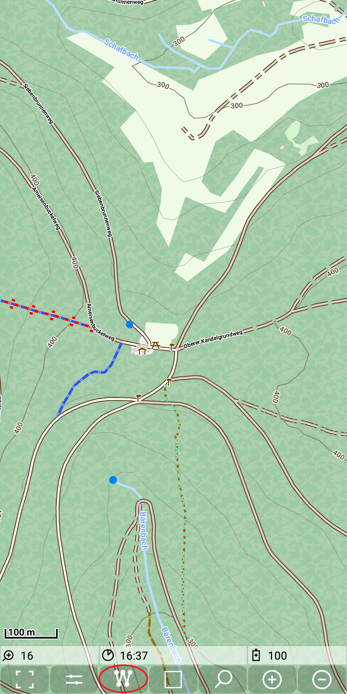
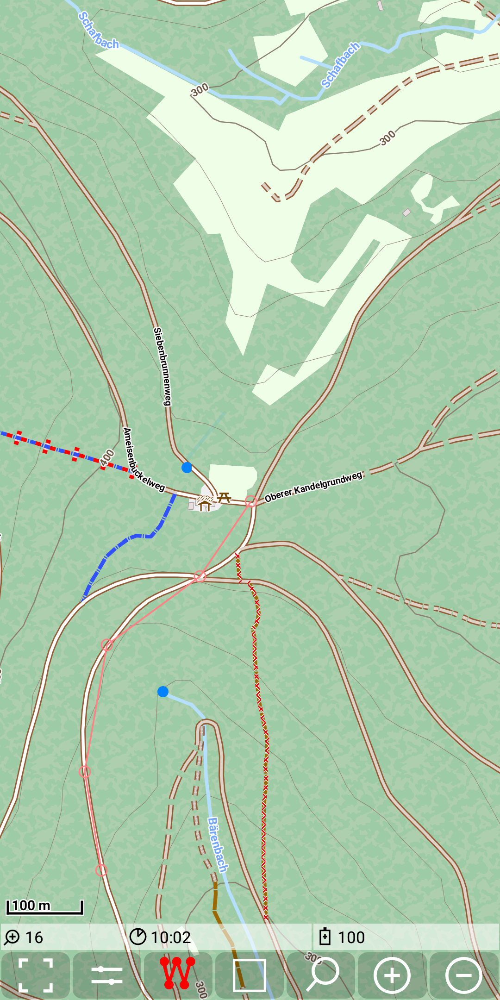
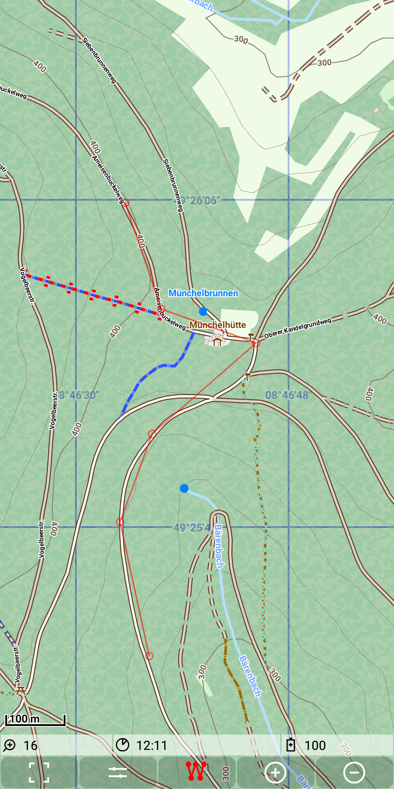
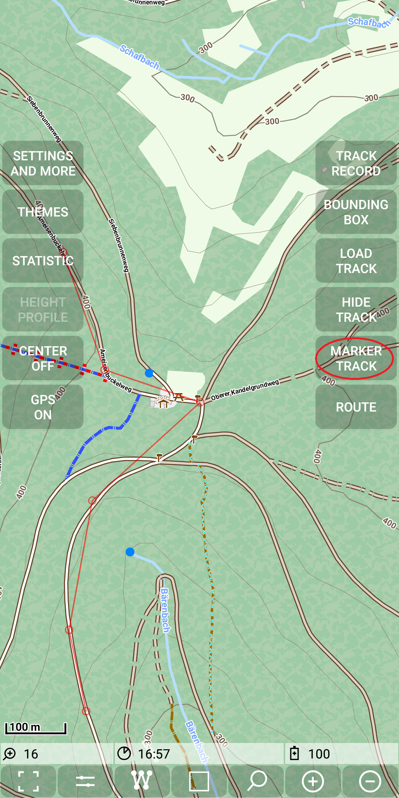
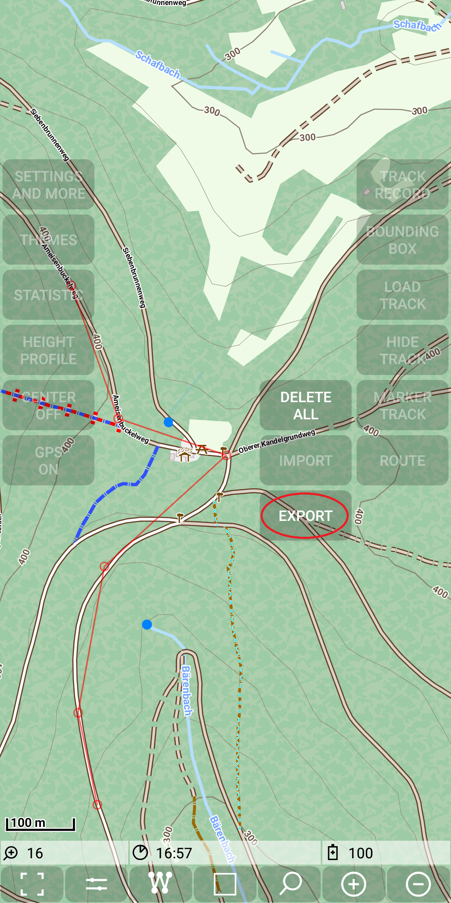

<small><small>[Back to Index](../../../index.md)</small></small>

## Main Track Feature: marker track

A marker track is a sequence of manually set marker track points. Marker tracks are used in most cases as the basis for simple routing.
Another use case for marker track points is to determine distances along a given track.

For explanation purposes of the marker tracks we first change a few default settings:
- switch on <span style="color:gray">*Menu | Settings and more | Further settings | Show marker track*</span>
- switch off <span style="color:gray">*Menu | Settings and more | Further settings | Snap to way*</span>
- switch off route visibility with <span style="color:gray">*Menu | Route | Route off*</span>.

To start the special mode for a marker track press the corresponding quick control.
As a visual feedback the icon on this button get red. This implies that the edit mode for the marker track is active.

&nbsp;
&nbsp;

<a id="action"> </a>The following actions exists to edit the marker track:
- tap on a free area: add a new marker point at the end of the track
- tap on a marker point: delete this marker point
- tap on the connecting line between two marker points: insert a new point between the existing points
- drag and drop of a marker point: move the position of an existing marker point

You can even combine the last two actions to insert and immediately move the inserted point.
The following example shows a creation of such a track. Marker points are visible witch a small red circle, 
consecutive points are connected with a thin red line:

&nbsp;
&nbsp;
&nbsp;

After finishing don't forget to press again the marker track quick control to switch off the marker track edit mode.

&nbsp;

Alternatively the edit mode will be left after 15s of inactivity.

Hint: Be careful with a circular marker track. To close the circle don't tap an the first point, since it would be deleted. Place the last point close,
but not too close to the first point. Use drag and drop to move it to the target position.

**Export Marker Track**

A marker track can be exported via
<span style="color:gray">*Menu | Marker Track | Export*</span>.

&nbsp;
&nbsp;

The export of an marker track generates a .gpx file in the directory ./MGMapViewer/track/gpx.
The filename has the structure \<date>_\<time>_MarkerTrack.gpx.

For the example above the result looks like:

```
<?xml version="1.0" encoding="UTF-8"?>
<gpx>
	<trk>
		<name>20201101_164510_MarkerTrack</name>
		<desc>start=01.01.1970_00:00:00 duration=0:00:00 totalLength=986.02 gain=48.4 loss=0.0 minEle=353.5 maxEle=401.8 numPoints=6</desc>
		<trkseg>
			<desc>start=01.01.1970_00:00:00 duration=0:00:00 totalLength=986.02 gain=48.4 loss=0.0 minEle=353.5 maxEle=401.8 numPoints=6</desc>
			<trkpt  lat="49.428184" lon="8.776523">
			</trkpt>
			<trkpt  lat="49.429413" lon="8.776128">
				<ele>353.5</ele>
			</trkpt>
			<trkpt  lat="49.431366" lon="8.776677">
				<ele>362.6</ele>
			</trkpt>
			<trkpt  lat="49.432851" lon="8.779183">
				<ele>386.2</ele>
			</trkpt>
			<trkpt  lat="49.433342" lon="8.776952">
				<ele>393.1</ele>
			</trkpt>
			<trkpt  lat="49.435117" lon="8.775999">
				<ele>401.8</ele>
			</trkpt>
		</trkseg>
	</trk>
</gpx>
```

**Import Marker Track**

There are two options to get a gpx back as a marker track:

1. Make the marker track the selected track and then use
<span style="color:gray">*Menu | Marker Track | Import*</span>  as a second step.
As a side effect of the import the selected track will be hidden - so then you see only the original marker track.
2. Use directly the context menu entry "marker track" in the statistic view.

<small><small>[Back to Index](../../../index.md)</small></small>