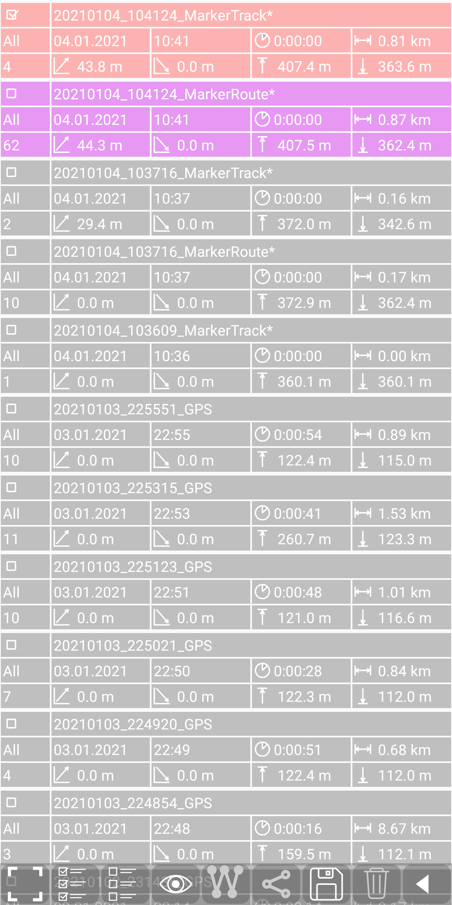
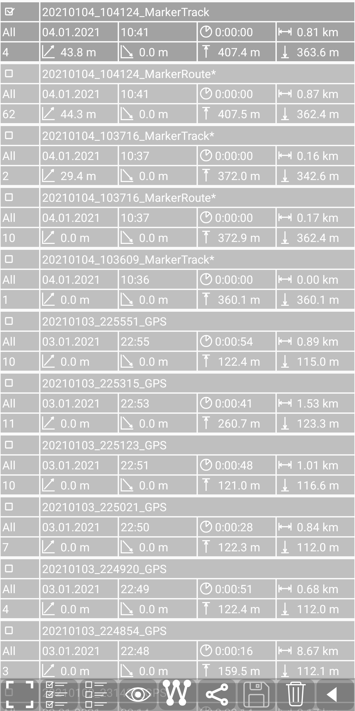
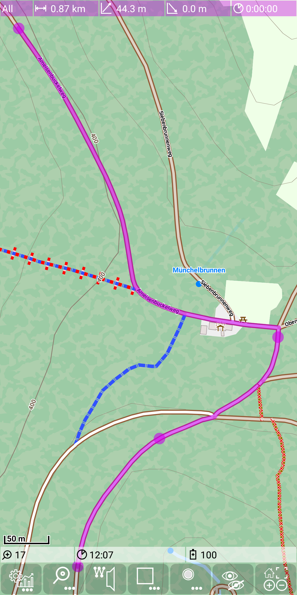

<small><small>[Back to Index](../../../index.md)</small></small>

## Main Track Feature: marker track

#### Edit marker track

A marker track is a sequence of marker track points. Usually marker tracks are used for a [basic routing](../Routing/routing.md).

For explanation purposes of the marker tracks switch change the following setting:  
Use  +  and switch off <span style="color:gray">*Automatic marker settings*</span>

Now switch via  +  the marker track edit mode on.
Tap on a way to set the first marker track log point, tap on a second point along the way to get a second marker track log point. You'll get something
like this:

&nbsp;

We see here the two points each with a purple circle and we see already the marker route between these points. The marker track is currently fully transparent, so it is not visible.
For explanation purposes we change this. Use  +  to make the track transparency
control visible. Move the seek bar for the marker track log to the right position (visible) and the seek bar for the route track log to the middle position (semi transparent).

&nbsp;

Now we see the marker track log and semi-transparent the resulting route track log. You may have noticed that the marker track edit mode is switched back to "off"
(from  to ). This happens automatically, if we don't
change it for more than 15 seconds.

Now switch via  +  the marker track edit mode again on
and set a few more points.

&nbsp;

Right now we have only added new points to the marker track. But there are some more actions to modify an existing track.

<a id="action"> </a>The following actions exists to edit the marker track:
- tap on a free area: add a new marker point at the end of the track
- tap on a marker point: delete this marker point
- tap on the connecting line between two marker points: insert a new point between the existing points (Attention: the route track overwrites this behaviour - so in fact you
have to tap on the connecting routing line to add a new marker point)
- drag and drop of a marker point: move the position of an existing marker point

You can even combine the last two actions to insert and immediately move the inserted point.

Let's try it: Tap the third marker point and let it dispear:

&nbsp;

Now tap an the (semi-transparent) purple line and move it around to an alternative way:

&nbsp;

Finally switch off the marker track edit mode via
 + 
Alternatively (as we have already seen) the edit mode will be left after 15s of inactivity.

The full power of marker tracks becomes visible in conjunction with the [basic routing](../Routing/routing.md) feature.

Before starting with this feature switch back the settings:
Use  +  and switch on <span style="color:gray">*Automatic marker settings*</span>.
The automatic mode will reset the transparency settings whenever you start to edit a new marker track.

#### Save Marker Track

A marker track can be saved via the [statistic activity](../../FurtherFeatures/Statistic/statistic.md)
(use  +  to open it).
Tap on the pink marker track entry to select it:

&nbsp;

Then press  to make it persistent. You may notice that the "*" at the and of the name disappears.
With  you go back to the main activity.

The export of a marker track generates a .gpx file in the directory ./MGMapViewer/track/gpx.
The filename has the structure \<date>_\<time>_MarkerTrack.gpx.

For the example above the result looks like:

```
<?xml version="1.0" encoding="UTF-8"?>
<gpx version="1.1" creator="MGMap">
	<metadata>
		<name>20210104_104124_MarkerTrack</name>
		<time>2021-01-04T10:41:24</time>
	</metadata>
	<trk>
		<name>20210104_104124_MarkerTrack</name>
		<desc>start=04.01.2021_10:41:24 duration=0:00:00 totalLength=805.42 gain=43.8 loss=0.0 minEle=363.6 maxEle=407.4 numPoints=4</desc>
		<trkseg>
			<desc>start=04.01.2021_10:41:24 duration=0:00:00 totalLength=805.42 gain=43.8 loss=0.0 minEle=363.6 maxEle=407.4 numPoints=4</desc>
			<trkpt  lat="49.430433" lon="8.776105">
				<ele>363.6</ele>
			</trkpt>
			<trkpt  lat="49.431726" lon="8.777377">
				<ele>371.8</ele>
			</trkpt>
			<trkpt  lat="49.432755" lon="8.779228">
			</trkpt>
			<trkpt  lat="49.435882" lon="8.775181">
				<ele>407.4</ele>
			</trkpt>
		</trkseg>
	</trk>
</gpx>
```

Now hide current marker track (and resulting route) with  +  as
we don't need it anymore.

#### Import Marker Track / Load Marker Track
The marker track can be reloaded also via the [statistic activity](../../FurtherFeatures/Statistic/statistic.md)
(use  +  to open it).
Tap on the marker track entry to select it:

&nbsp;

Now use  to open this gpx again as a marker track ... and we back to

&nbsp;

Since we enabled the automatic marker settings, the marker track is again fully transparent while the resulting route track is well visible.

#### Marker Track settings

We have already used the further settings preference screen ( + )
to change the  <span style="color:gray">*Automatic marker settings*</span>.  
The is a second setting  <span style="color:gray">*Snap to way*</span>, which let new marker points
automatically snap to a close way.


#### Marker Track use cases

In the context of routing we will see two main use cases:
1. setup a basic route (or modify a previously setup route)
2. load a recorded track as marker track and automatically try to correct recording inaccuracies. This process is also called map matching (triggered via
 + )

 For the first routing use case the setting marker track visibility should be switched off and the setting "snap to way" should be on,
but for the second (map matching) use case it's vice versa. To prevent the need for a manually change of these options each time, the <span style="color:gray">*Automatic marker settings*</span> setting tries to distinguish between both
use cases. The criteria for this automatic mode is related to the number of marker track points during
the load of the marker track. If this number is less then 200, then it is assumed that we are in the first use case, while a higher number of marker track points refers to the second use case.


<small><small>[Back to Index](../../../index.md)</small></small>