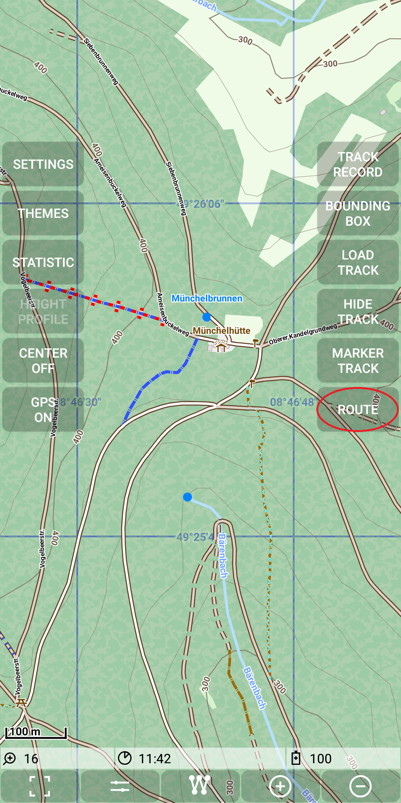
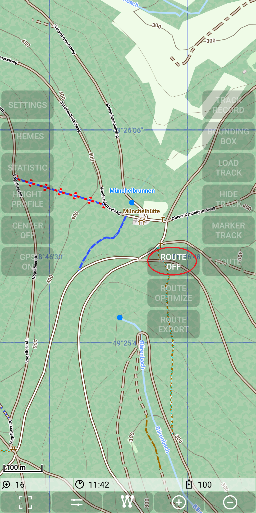
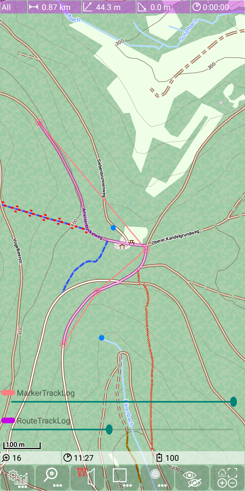
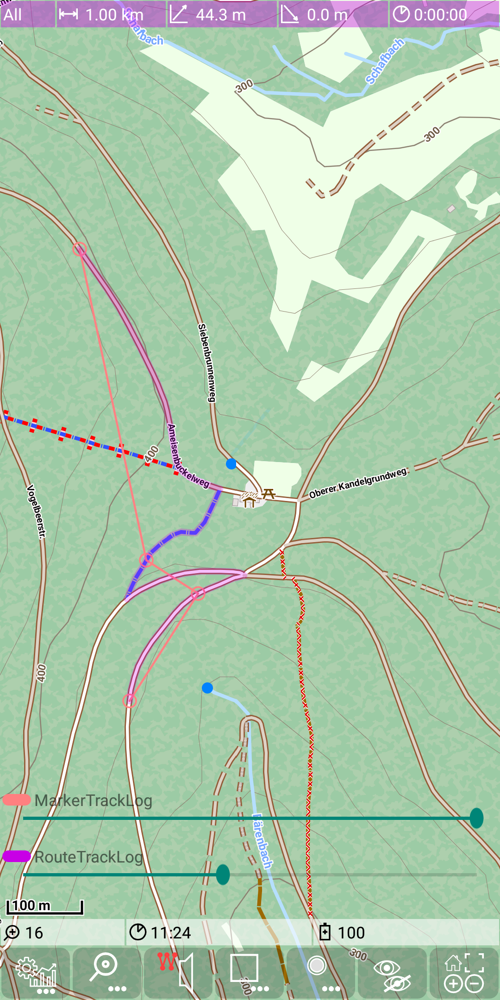

## Main Track Feature: marker track 

A marker track is a sequence of manually set marker track points. Marker tracks are used in most cases as the basis for simple routing.
Another use case for marker track points is to determine distances along a given track.

For explanation purposes of the marker tracks we first deactivate routing with  *Menu | Route | Route off*.

&nbsp;
&nbsp;

To start the special mode for a marker track press the corresponding quick control.
As a visual feedback the icon on this button get red. This implies that the edit mode for the marker track is active.

&nbsp;
&nbsp;

"The following actions exists to edit the marker track:
- tap on a free area: add a new marker point at the end of the track
- tap on a marker point: delete this marker point
- tap on the connecting line between two marker points: insert a new point between the existing points
- drag and drop of a marker point: move the position of an existing marker point

Be careful with a circular marker track. To close the circle don't tap an the first point, since it would be deleted. Place the last point close,
but not too close to the first point. Use drag and drop to move it to the target position. 

The following example shows a creation of such a track. Marker points are visible witch a small red circle, 
consecutive points are connected with a thin red line:

&nbsp;
&nbsp;
&nbsp;
&nbsp;
&nbsp;
&nbsp;

After finishing don't forget to press again the marker track quick control to switch off the marker track edit mode.

&nbsp;

**Export Marker Track**

The export of an marker track generates an .gpx file in the directory ./MGMapViewer/track/gpx.
The filename has the structure \<date>_\<time>_MarkerTrack.gpx.

For the example above the result looks like:

&nbsp;

**Import Marker Track**

In opposite to the export of an marker track the import does not read a .gpx file. Instead the current selected track will be imported 
as a marker track. So if you want to reopen a saved marker track, then open the .gpx file and make it the selected track and the use the import
as a second step.

