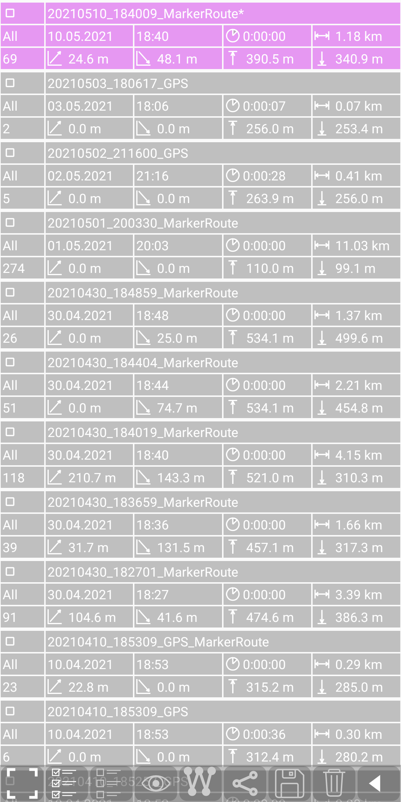
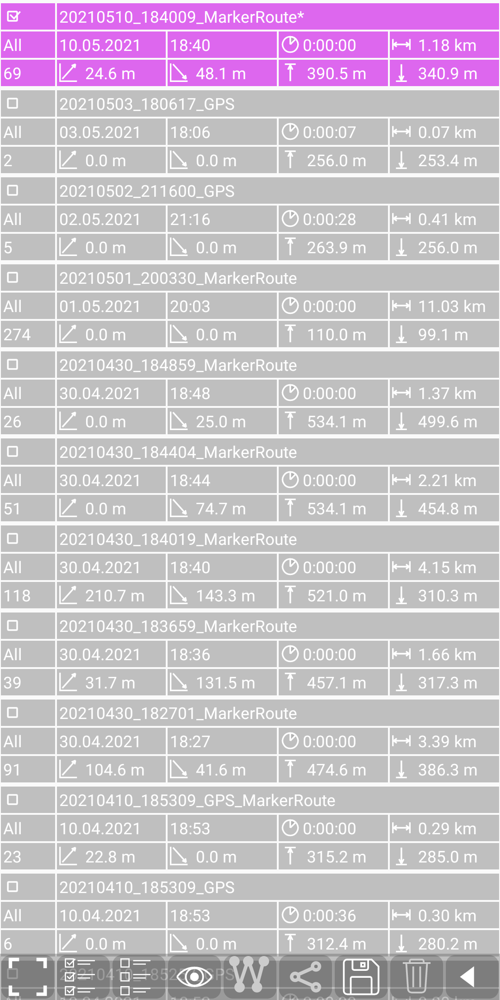
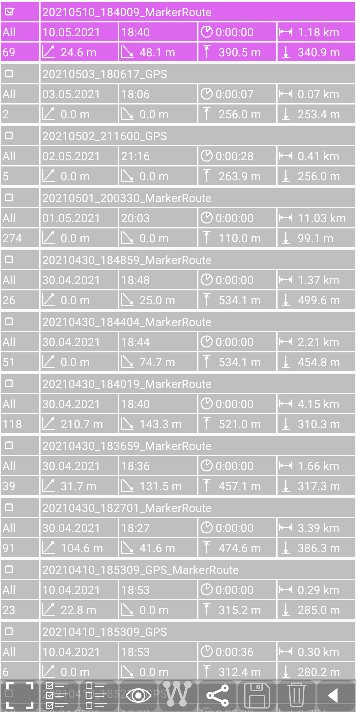
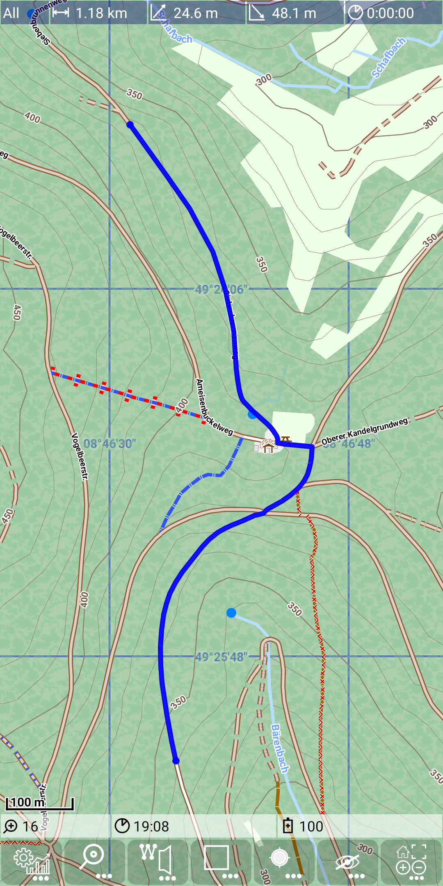
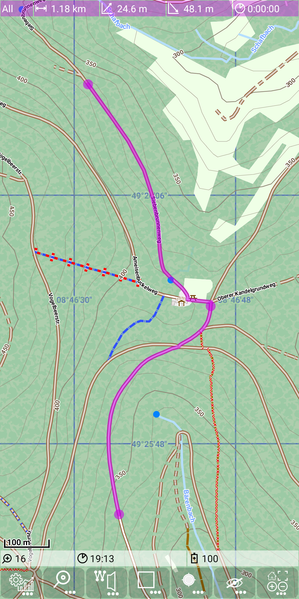

<small><small>[Back to Index](../../../index.md)</small></small>

## Main Track Feature: basic routing

This feature provides a basic route calculation (shortest path) based on a sequence of given points. Although it's not important for the usage of this feature
it should be mentioned, that route calculation is using a simple [A\*](https://de.wikipedia.org/wiki/A*-Algorithmus) algorithm.

There is a further feature [routing hints](../../FurtherFeatures/RoutingHints/hints.md), which is based on this routing feature.

#### Create a route

Switch on the route edit mode with  + .
Set a few points and you'll get something like this:

&nbsp;

Switch off the route edit mode with  + .

As it is visible in this example we need only a very few points to mark a route exactly. If the route (representing the shortest path)
doesn't match our expectation, we need to move, insert or delete route points to get the route to the desired path.

When the route edit mode is switched on (marked by the red "W" in  icon) you
can use following actions:
- tap on a free area: add a new point at the end
- tap on a point: delete this point
- tap on the connecting route between two points: insert a new point between the existing points
- drag and drop of a marker point: move the position of an existing route point
- tap on a route segment (to insert a point) and move it immediately to its new position.

A few remarks to this edit operations:
- If an action above fails, check whether the marker track "edit"-Mode is still switched on (there is a timer to deactivate it).
- There is a "snap to way" mechanism, so the point snaps to the next (close) way. The term "close" depends on the current zoom level, so if your point snaps
to the next way although you don't want it, zoom in and set it again until you get the desired position.
- If the routing provides a "detour" and you just want to mark the direct line between two point, then insert another point somewhere in between (away from all ways;
zoom in, if necessary)
- a long press on the route toggles between normal mode (purple line) and gain/loss mode (colored depending gain/loss). For details about this mode see
[Track visualization](../../MainTrackFeatures/TrackVisualization/trackvisu.md). This just change the visualisation, but not the route itself.

&nbsp;

#### Save route track

A route track can be saved via the [statistic activity](../../FurtherFeatures/Statistic/statistic.md)
(use  +  to open it).
Tap on the purple marker route entry to select it.
Then press  to make it persistent. You may notice that the "*" at the and of the name disappears.
With  you go back to the main activity.

&nbsp;
&nbsp;
&nbsp;

The export of a route track generates a .gpx file in the directory ./MGMapViewer/track/gpx.
The filename has the structure \<date>_\<time>_MarkerRoute.gpx. This gpx file contains the
track points from the calculated route. But additionally it contains the points used for route
calculation as way points. This "dual" storage allows multiple further usage:
<table>
<tr><td>open with  as selected track</td><td>open with  again as a route</td></tr>
<tr><td></td><td></td></tr>

</table>
The second option allows (after  + ) to modify again the route.

<small><small>[Back to Index](../../../index.md)</small></small>