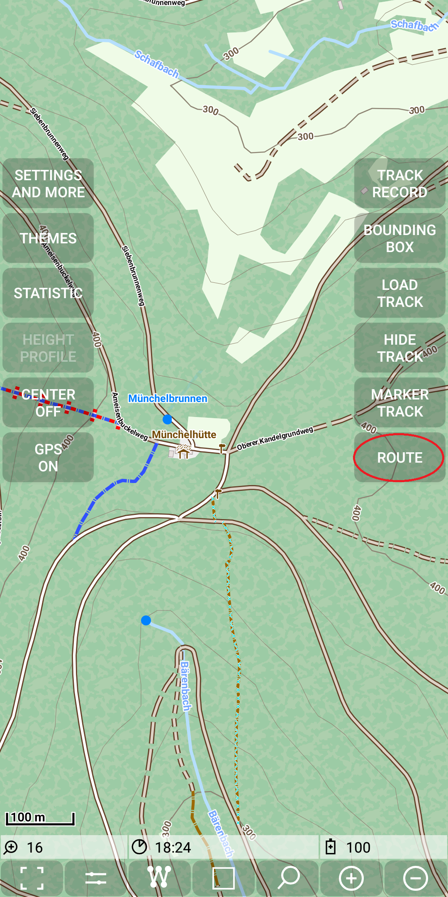
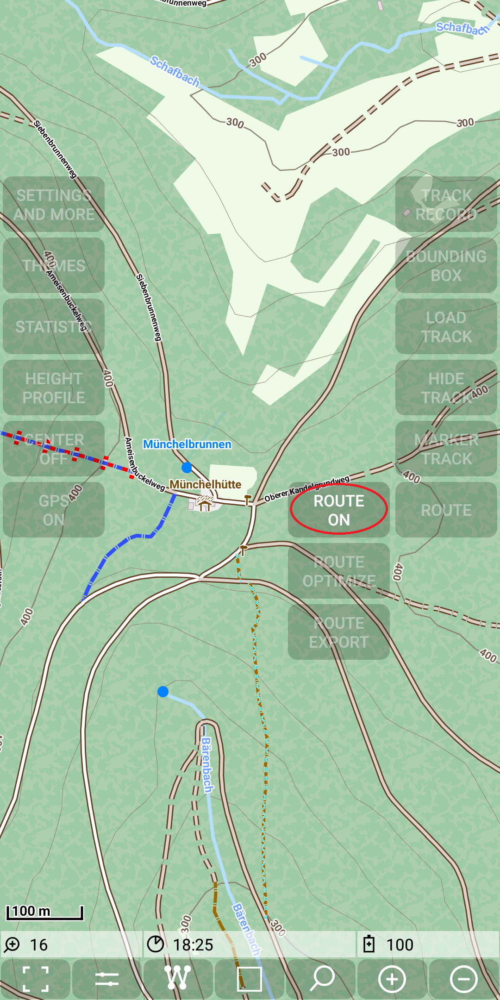
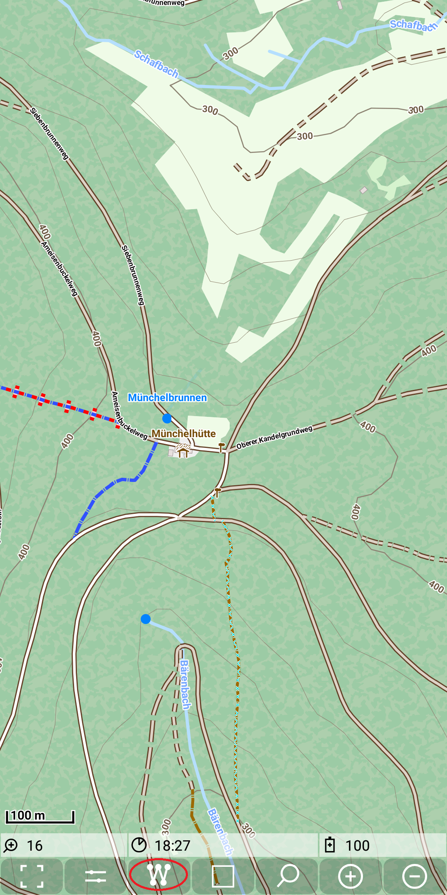
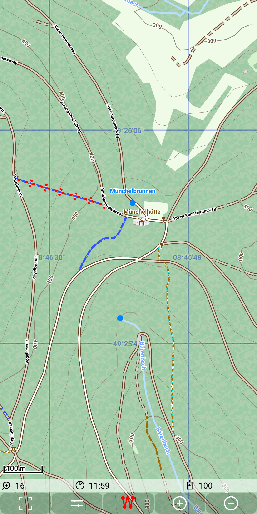
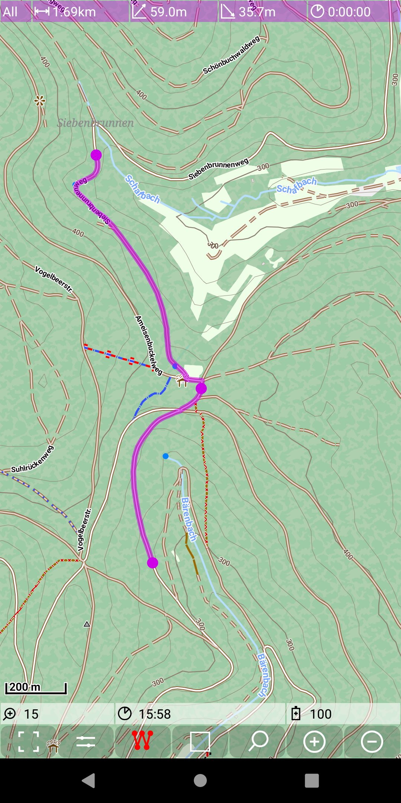
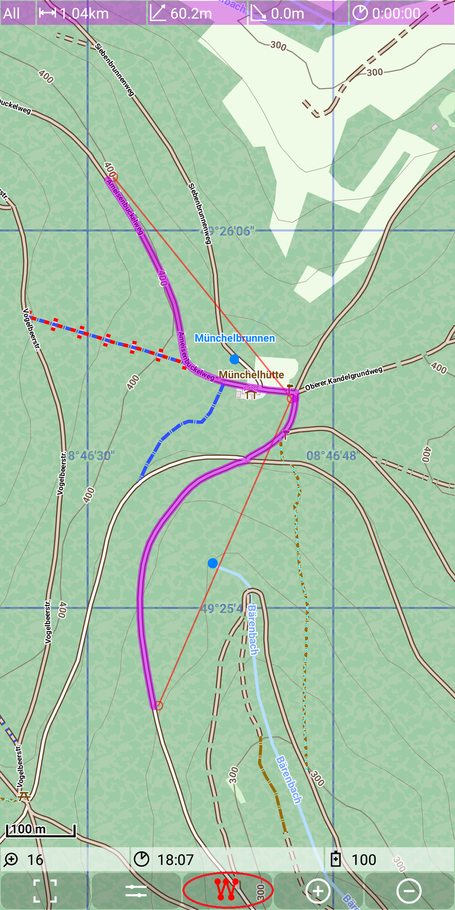

## Main Track Feature: routing

This feature provides a basic route calculation (shortest path) based on a [marker track](../MarkerTrack/markertrack.md).

For the explanations around the marker tracks we switched off routing. Now we have to make sure that is is switched on again
with with  *Menu | Route | Route on*.

&nbsp;
&nbsp;

As already said the routing is an addon feature for the marker track. So gain we use the quick control to start edit the
marker track and verify the red color of the icon.

&nbsp;
&nbsp;
 
Now we start set points:

&nbsp;
&nbsp;
&nbsp;

After finishing don't forget to press again the marker track quick control to switch off the marker track edit mode.

&nbsp;

As it is visible in this example we need only a very few points to mark a route exactly. If the route (representing the shortest path) 
doesn't match our expectation, we need to move or insert another marker point to get the route as desired. Remember the actions to 
modify a marker track as described in <a href="../MarkerTrack/markertrack.md#action">here</a>.

**Route export**

The route menu provides also an option to save the calculated route to a gpx file in the directory ./MGMapViewer/track/gpx.
The filename has the structure \<date>_\<time>_MarkerRoute.gpx. This gpx consists of much more track points to describe the
exact path as it is visible in the map.

**Route optimize**

This feature is **not** related to calculated routes as seen above. Instead, if you have a real world track then this track doesn't exactly 
match the ways you have used. And especially on zigzag ways the calculated length may differ from real world. If you wan't to
get precise data, then you need to match the recorded track to the map. Therefore the [graphhopper](https://www.graphhopper.com) project 
calls this function map matching. But we want to do the same without the internet and a server infrastructure.

So the idea is first to import the recorded real world track as the marker track and to use the default routing to connect each
two consecutive points to the overall route. Due to the track points which might not be exactly, the resulting route contains some typical
deviations from the recorded track. The "Route optimize" function tries to correct them. This cannot be succeed 100%, but it can 
correct most of this cases. In the result the optimized route reflects the real length of the track quite well. If necessary,
a manually correction of remaining recording failures can be done easily by using the normal marker track editing functions. 

The next figures show two examples of typical route optimizations (each example with one picture before and one after optimization):

&nbsp;
&nbsp;

&nbsp;
&nbsp;

