<small><small>[Back to Index](../../../index.md)</small></small>

## Main Track Feature: routing

```
Disclaimer: Use this feature with care - always check and follow a proposed route ONLY if traffic rules allow this!
```

This feature provides a route calculation based on a sequence of given points and a given routing profile.
The following profiles are configured:
- 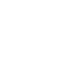 Shortest path
-  Hiking
- 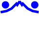 MTB K1 S1
- 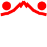 MTB K2 S2
- 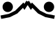 MTB K3 S3
- 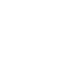 Trekking bike

Don't expect here somthing which is comparable with google maps or similar services. The routing is based entirely on the map data and works 100% offline.
It is extremly helpful for marking the route you want to go.
The routing algorithm is based on a bidirectional A\*. It guarantees to find the optimal path and it's much faster then the unidirectinal A\*, which becomes significant for longer routes. 

There is a further feature [turning instructions](../../FurtherFeatures/RoutingHints/hints.md), which is based on this routing feature.

#### Create a route

Switch on the route edit mode with  + .

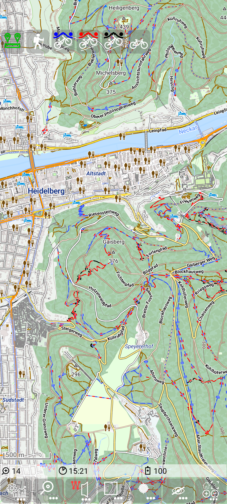&nbsp;

Set a few points and you'll get something like this:

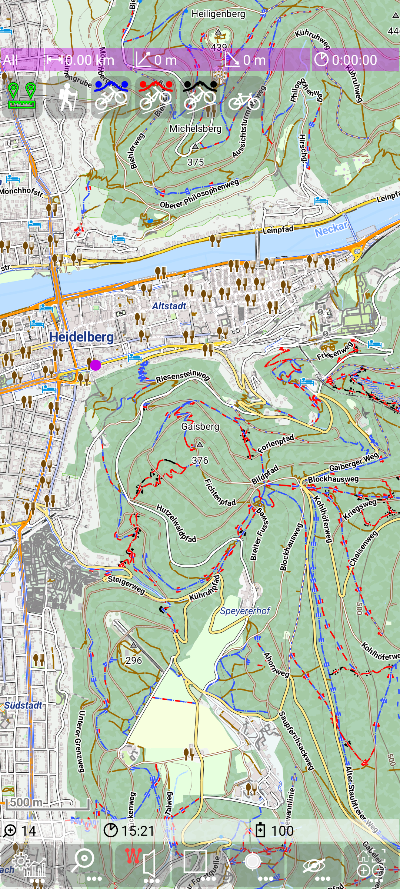&nbsp;
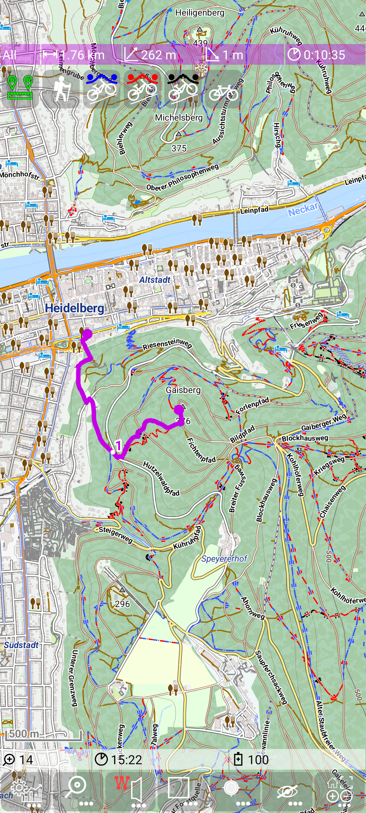&nbsp;

Currently the shortest path routing profile  is selected. You can step through the other profiles
and the resulting route may change depending on the profile:

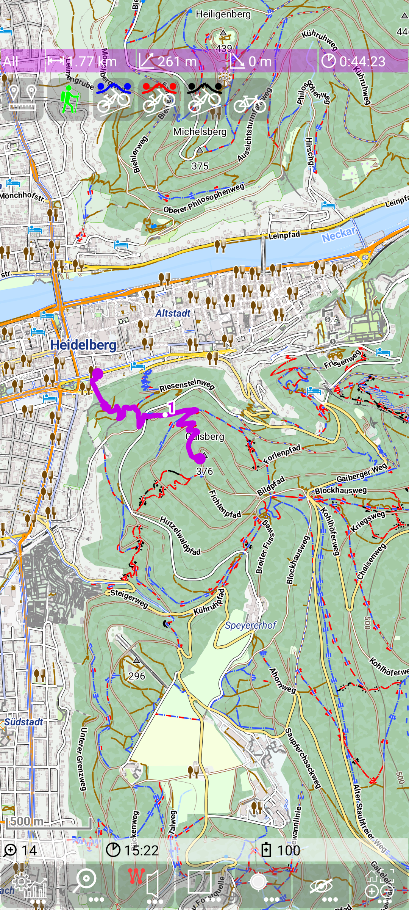&nbsp;
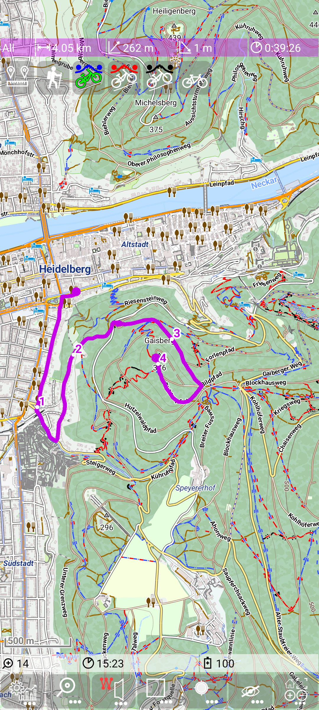&nbsp;
&nbsp;

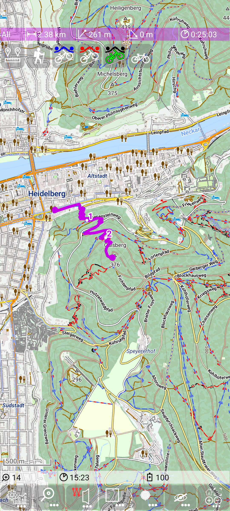&nbsp;
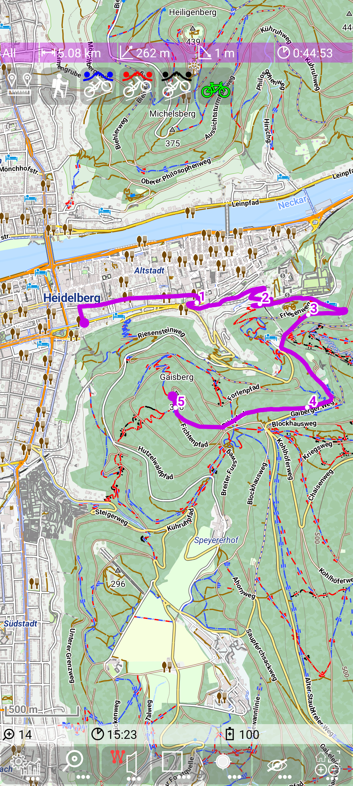&nbsp;

Switch off the route edit mode with  + .

As it is visible in this example we need only a very few points to mark a route exactly. If the route 
doesn't match our expectation, you need to move, insert or delete route points to get the route to the desired path.

When the route edit mode is switched on (marked by the red "<span style="color:red">W</span>" in  icon) you
can use following actions:
- tap on a free area: add a new point at the end
- tap on a point: delete this point
- tap on the connecting route between two points: insert a new point between the existing points
- drag and drop of a marker point: move the position of an existing route point
- tap on a route segment (to insert a point) and move it immediately to its new position.

A few remarks to this edit operations:
- If an action above fails, check whether the marker track "edit"-Mode is still switched on (there is a timer to deactivate it).
- There is a "snap to way" mechanism, so the point snaps to the next (close) way. The term "close" depends on the current zoom level, so if your point snaps
to the next way although you don't want it, zoom in and set it again until you get the desired position.
- If the routing provides a "detour" and you just want to mark the direct line between two point, then insert another point somewhere in between (away from all ways;
zoom in, if necessary)
- a long press beside the route hides the route (and other tracks) for 1.5 seconds - enough to see the properties of the path that might be hidden by the route.
- a long press on the route toggles between normal mode (purple line) and gain/loss mode (colored depending gain/loss). For details about this mode see
[Track visualization](../../MainTrackFeatures/TrackVisualization/trackvisu.md). This just change the visualisation, but not the route itself.

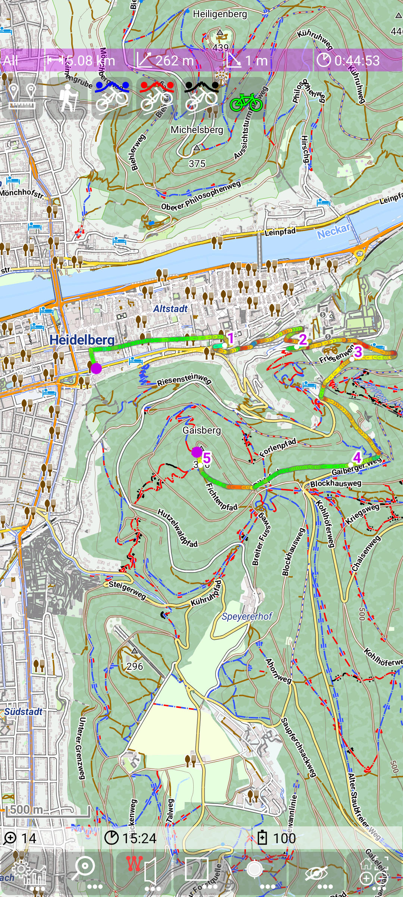&nbsp;


#### Save route track

If you wand to save the route , use  + 


Alternatively a route track can be saved via the [statistic activity](../../FurtherFeatures/Statistic/statistic.md)
(use  +  to open it).
Tap on the purple marker route entry to select it.
Then press  to make it persistent. You may notice that the "*" at the and of the name disappears.
With  you go back to the main activity.

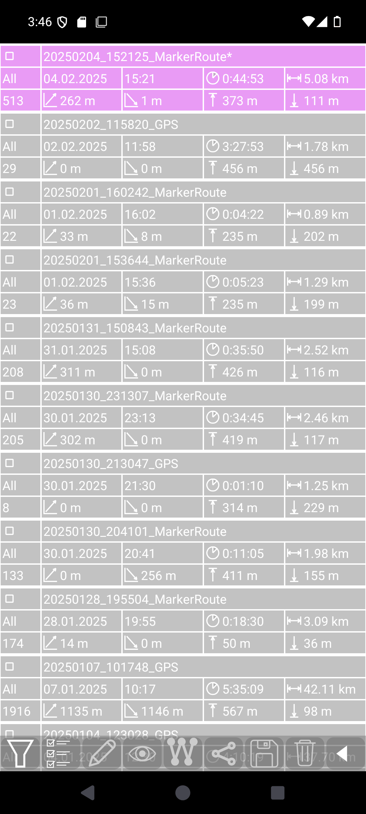&nbsp;
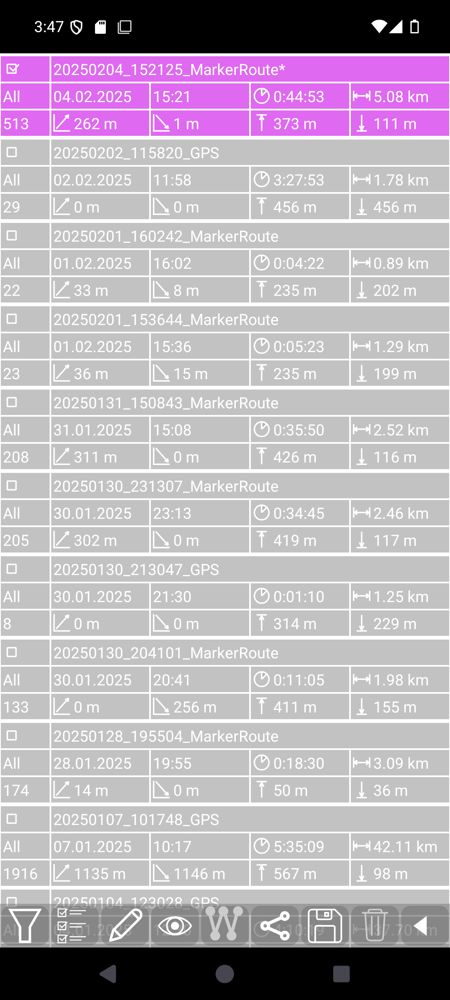&nbsp;
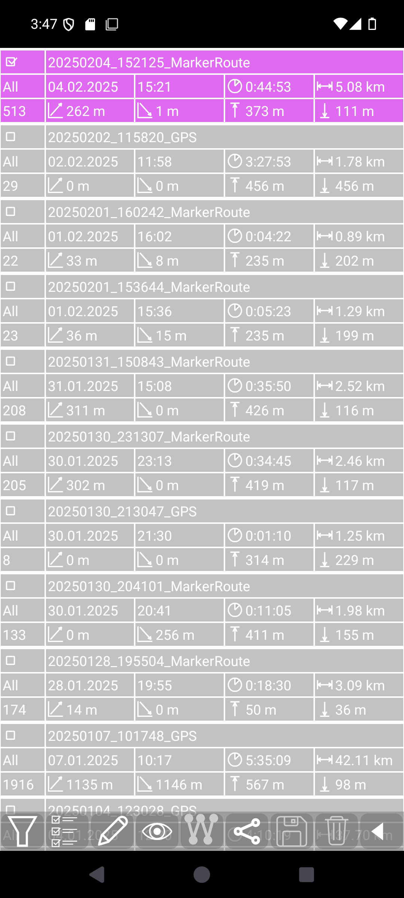&nbsp;


The save action of a route track generates a .gpx file in the directory MGMapViewer/track/gpx.
The filename has the structure \<date>_\<time>_MarkerRoute.gpx. This gpx file contains the
track points from the calculated route. But additionally it contains the points used for route
calculation as way points.

#### Reopen saved route track

The "dual" storage of route tracks allows multiple further usage:
<table>
<tr><td>open with  as selected track</td><td>open with  again as a route</td></tr>
<tr><td>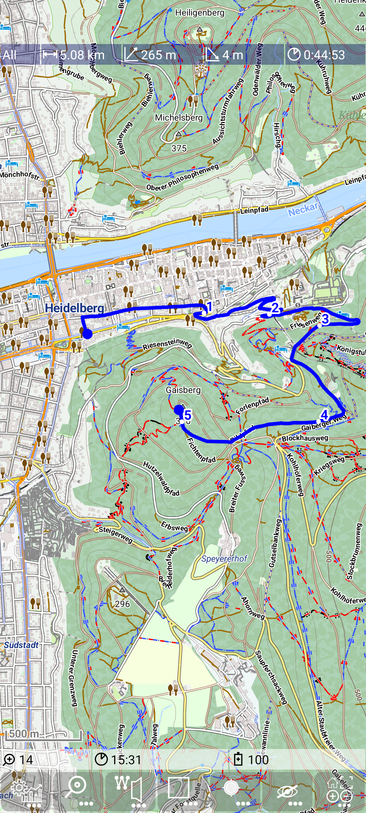</td><td>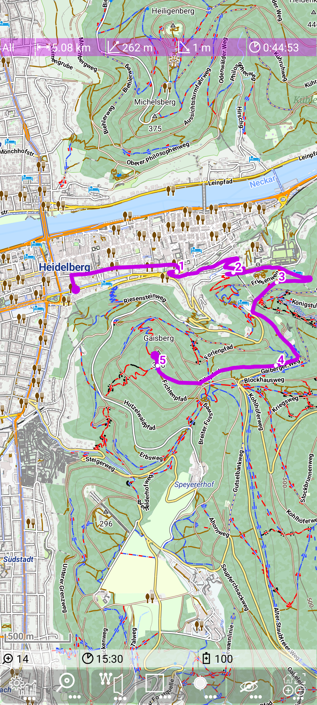</td></tr>
</table>
The second option allows (after  + ) to modify again the route.


<small><small>[Back to Index](../../../index.md)</small></small>