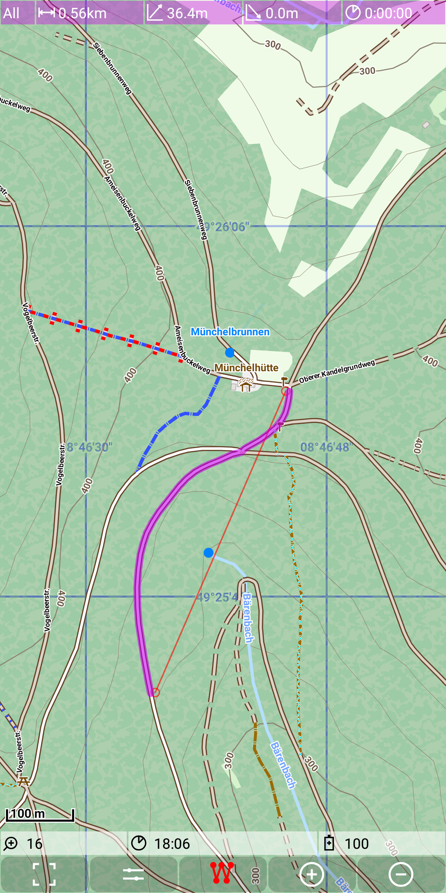
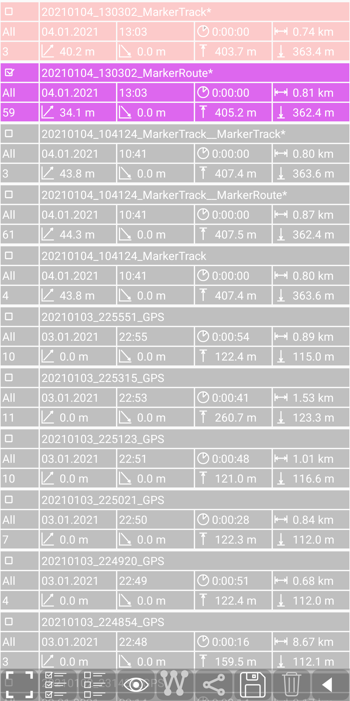
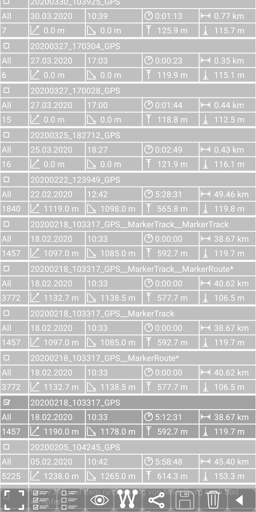
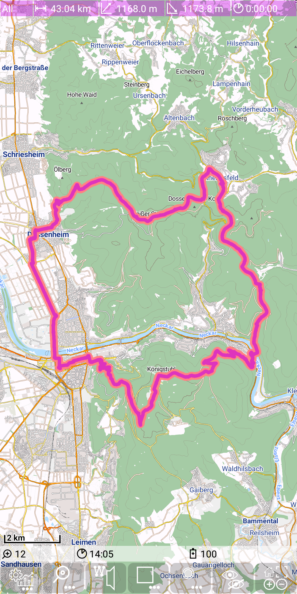
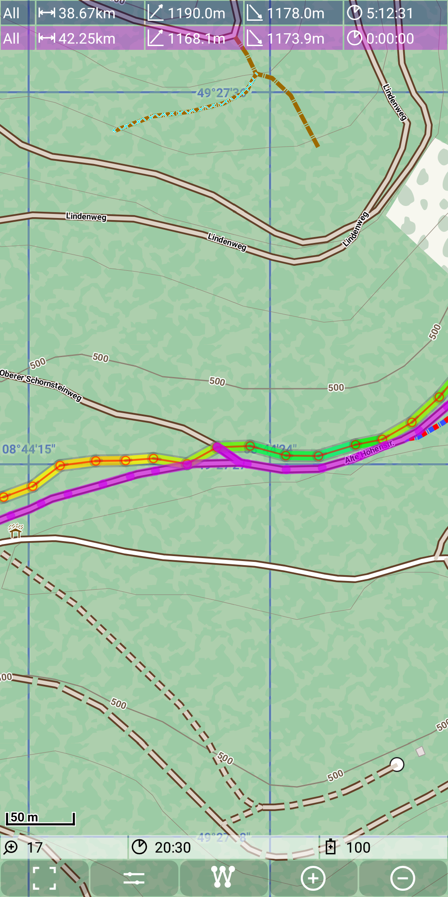
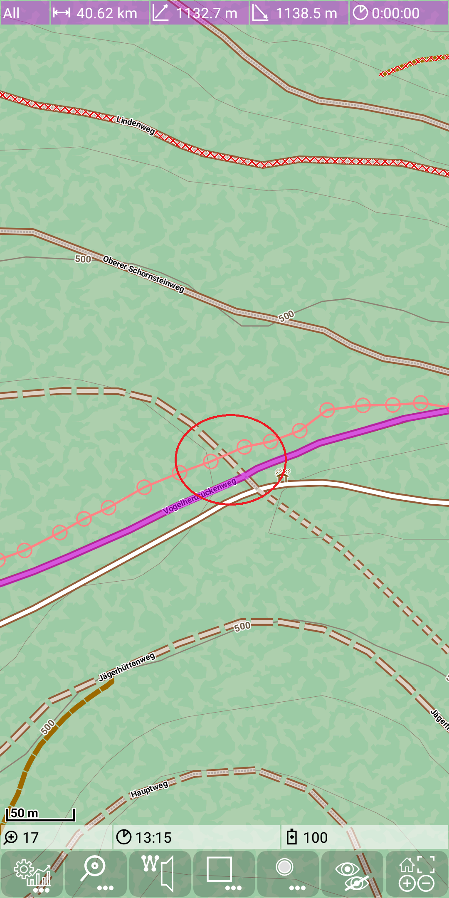
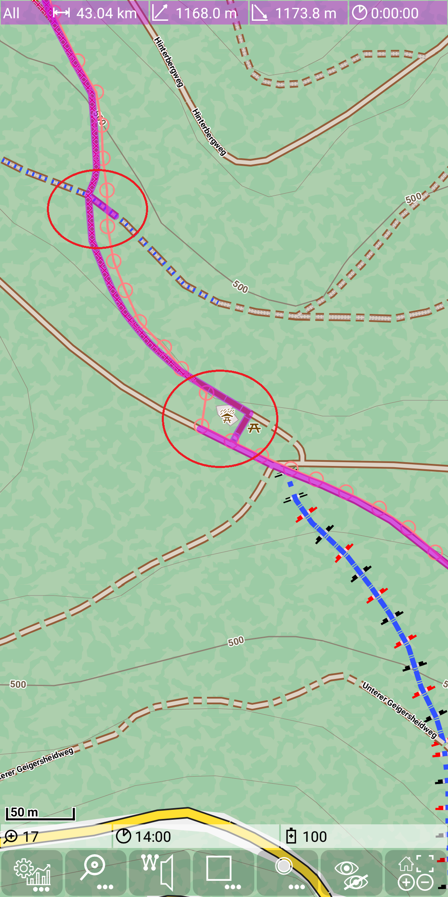

<small><small>[Back to Index](../../../index.md)</small></small>

## Main Track Feature: basic routing

#### Create a route

This feature provides a basic route calculation (shortest path) based on a [marker track](../MarkerTrack/markertrack.md).
But for a usage of the routing feature this isn't important, nevertheless it might be helpful for the understanding.
The route calculation is using an simple [A\*](https://de.wikipedia.org/wiki/A*-Algorithmus) algorithm.
There is a further feature [routing hints](../../FurtherFeatures/RoutingHints/hints.md), which is based on this routing feature.

The [marker track](../MarkerTrack/markertrack.md) documentation has already explained almost all relevant usage.
So we give here only a short summary:

Switch on marker track edit mode with  + .
Set a few points and you'll get something like this:

&nbsp;

Switch off marker track edit mode with  + .

As it is visible in this example we need only a very few points to mark a route exactly. If the route (representing the shortest path)
doesn't match our expectation, we need to move or insert another point to get the route as desired.
So technically this means to move/insert/remove a marker point.
Therefore almost the same actions valid:
- tap on a free area: add a new point at the end
- tap on a point: delete this point
- tap on the connecting route between two points: insert a new point between the existing points
- long press on the connecting route between two points: this will switch this route segment to the direct air-line instead of the route along existing ways.
Long press on the air-line will switch back to the normal calculated route.
- drag and drop of a marker point: move the position of an existing marker point  
You can even combine insert and drag - tap on a route segment (to insert a point) and move it immediately to its new position.
- long press on a point: toggle between normal mode (purple line) and gain/loss mode (colored depending gain/loss).

Here we see the same route as above, just with gain/Loss mode switched on. For details about this mode see
[Track visualization](../../MainTrackFeatures/TrackVisualization/trackvisu.md).

&nbsp;

Remarks:
- If an action above fails, check whether the marker track "edit"-Mode is still switched on (there is a timer to deactivate it).
- The route points (in fact marker points) snap to the next way, if they are close enough. This behaviour can be toggled on/off via  
 +  and *Snap to way*.
- If there isn't found a route (because there is no close way or there is no connection found, which is short enough), then the connection will also be shown as
air-line.
- The visible route has a marker track as its basis, which is not visualized by default. The marker track visibility can be changed via seek bars
 + .
- It you want to save the route and you want to be able to modify the route later after reloading of it, then do not save the route, rather save the marker track.
If you reload it, the same route will be recalculated from this basis and you are still be able to change it again.
- In contrast, if you want to pass this route as a .gpx to someone else, then save the route track.

#### Save route track

A route track can be saved via the [statistic activity](../../FurtherFeatures/Statistic/statistic.md)
(use  +  to open it).
Tap on the purple marker track entry to select it:

&nbsp;

Then press  to make it persistent. You may notice that the "*" at the and of the name disappears.
With  you go back to the main activity.

The export of a route track generates a .gpx file in the directory ./MGMapViewer/track/gpx.
The filename has the structure \<date>_\<time>_MarkerRoute.gpx.

#### Marker route optimize / map matching

This feature is **not** related to calculated routes as seen above. Instead, if you have a real world track then this track doesn't exactly 
match the ways you have used. And especially on zigzag ways the calculated length may differ from real world. If you wan't to
get precise data, then you need to match the recorded track to the map. Therefore the [graphhopper](https://www.graphhopper.com) project 
calls this function map matching. But we want to do the same without the internet and a big server infrastructure.

We take a real world example: Open the statistic activity with
 +  and select
a real world track. Open it as marker track with 

&nbsp;
&nbsp;

Now we can run the map matching with
 + 

At a first glance, the result seems almost unchanged:

&nbsp;

But if we zoom in, we see some changes: left side before, right side after map matching:

&nbsp;
&nbsp;

&nbsp;
&nbsp;

These changes seem to be quite small, but there is an interesting comparision: If you take the original gps track, it has a length of
38.67km. After loading and route calculation we can see a length of 43.04km. Finally after map matching we are at a length of 40.62km.
So over the total distance these small changes are relevant for the track length calculation. If you compare these three length values
with the correct length (manually corrected way), then the track recording is always too short. In average you are missing about 2km
on a 50km tour. On the other hand the calculated length after loading as marker track is always too much - in average it's on a 50km
tour 4km longer than the GPS, so about 2km more than the real length. After map matching the track length is usually quite close to the real
track length, although typically there are sill some deviations to the perfect track.

<small><small>[Back to Index](../../../index.md)</small></small>