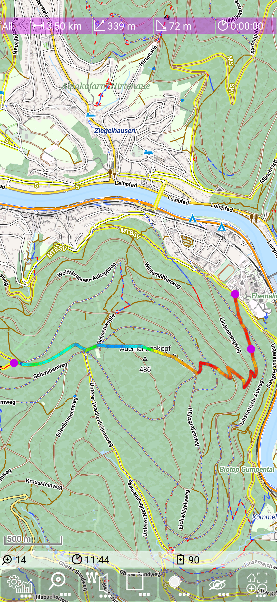
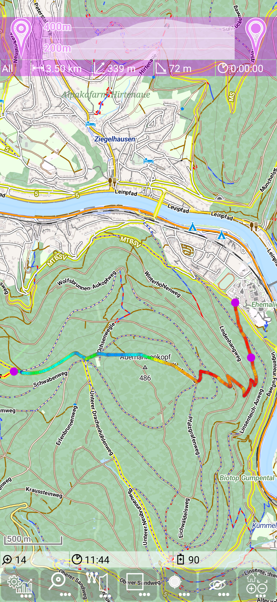
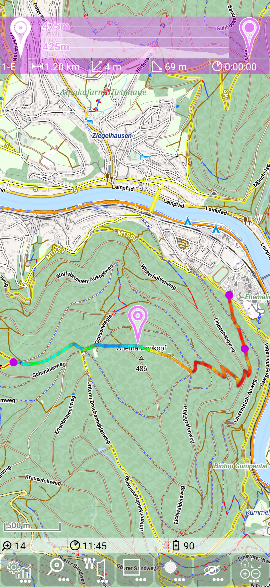
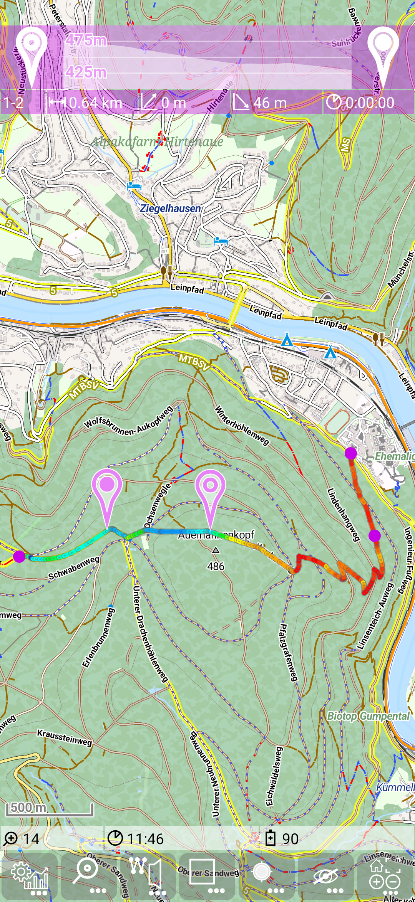
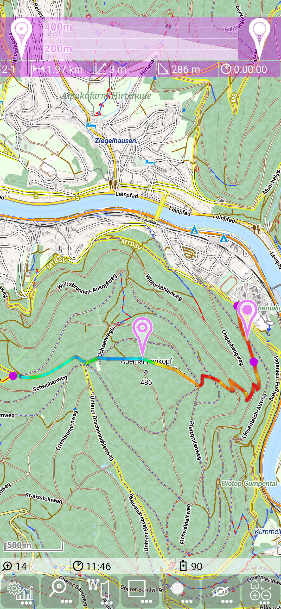
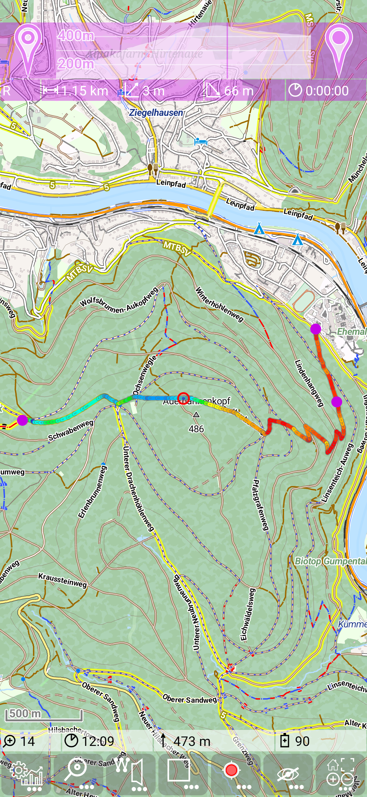
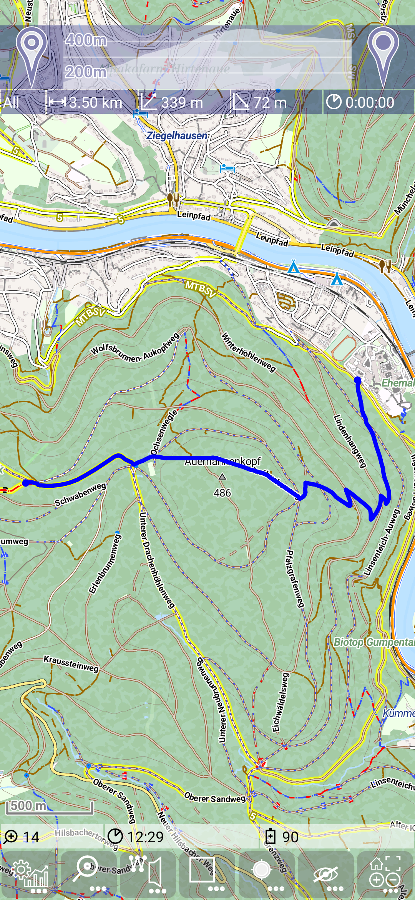
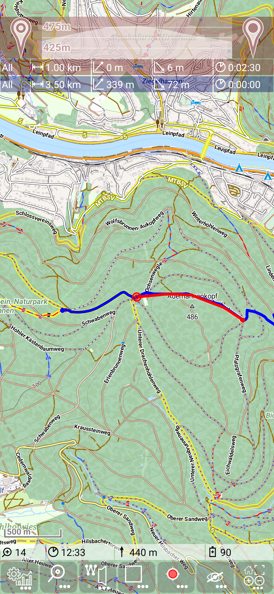

<small><small>[Back to Index](../../../index.md)</small></small>

## Main Track Feature: track details

Assume to have the following route planned (as visible in the first figure).
Then touch the dashboard entry and drag it down, then you'll get the track details view for the route:

&nbsp;
&nbsp;

The track details view consists of 
 - the start marker (marker 1)
 - the height profile 
 - the end marker (marker 2)
 
Now drag the start marker (marker 1) to a position on the track. The dashboard entry now shows in the segment indicator the entry "1-E", 
which means it shows the statistic from marker 1 to the end of the track.
Please notice that also the hight profile is adapted to this section.

Same thing can be done with the end marker (marker 2) (see next figure).
Now the statistic and the hight profile visualize the data between marker 1 and 2 (segment indicator "1-2").

&nbsp;
&nbsp;

If you place the end marker in front of the start marker (in terms of traveling direction of the route), the the dashbord and the 
height profile show the data of the reverse direction (segment indicator "2-1"). 

Finally take the start marker away from the route and place it anywere. After 2s it will move back to its track details base position.
As the result you will see the statistic between start of the route and end marker (segment indicator "S-2")

&nbsp;
&nbsp;

If you move currently along your route with GPS switched on (position is visible with the red circle), this position is also visible in the height profile - indicated by a vertical line.

&nbsp;

Track details view will be closed by dragging the dashboard entry to its original position.

This track details visualisation works with the route (as seen above), but also with the selected TrackLog and the recording TrackLog (see [track definitions](../../track.md)).

&nbsp;
&nbsp;

<small><small>[Back to Index](../../../index.md)</small></small>