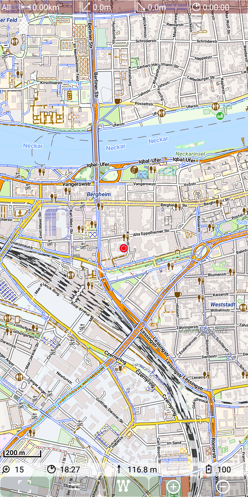
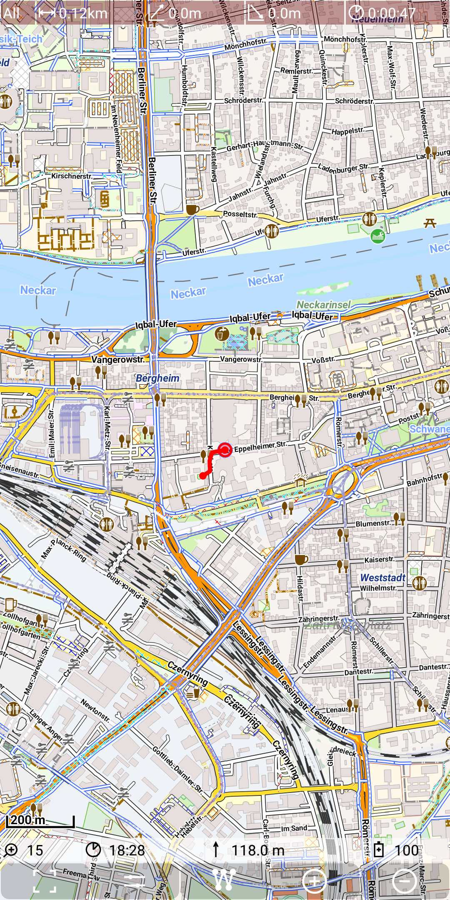
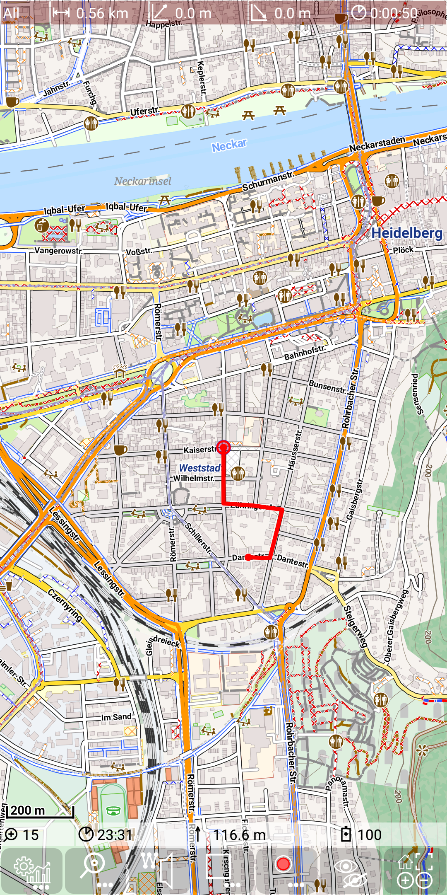
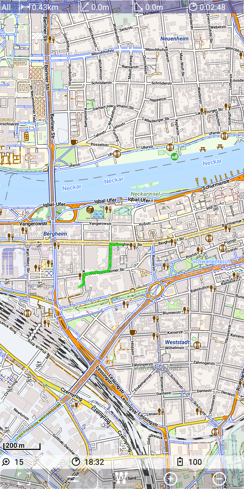
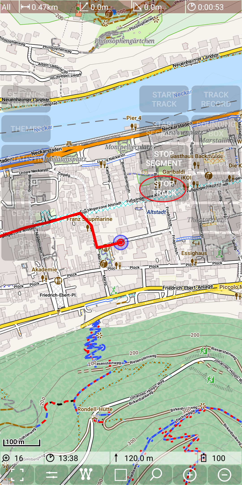
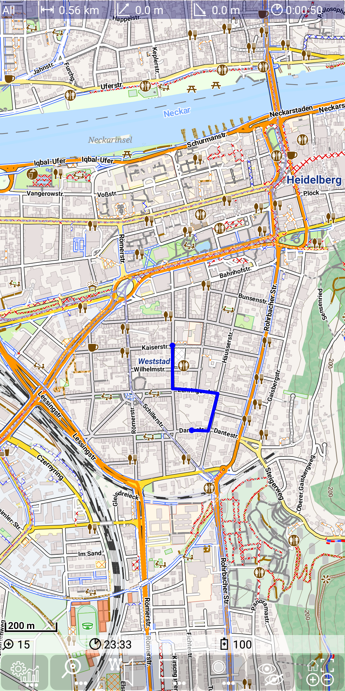

<small><small>[Back to Index](../../../index.md)</small></small>

## Main Track Feature: record a track

Start track recording with *Menu | Track Record | Start Track*.

&nbsp;
&nbsp;

Move a little bit around 

&nbsp;

and then stop recording with *Menu | Track Record | Stop Track*.

&nbsp;
&nbsp;

After the stop recording action this track becomes the "selected track":
 
&nbsp;

Each green segment represents the line between 2 successive recorded points. The small inner (gray) line
points in the direction of moving. The color green represents the fact, that the area is flat, so the 
track is neither ascending nor descending.

If you use instead of "Stop Track" the "Stop segment" button, then you can continue the track recording later
with the "Start Segment" Button. So a track consists of a number of segments, which is typically just 1.

**Note**: As long as the GPS is switched on there is a Notification active. It disappears after switching the GPS off.

&nbsp;

<small><small>[Back to Index](../../../index.md)</small></small>