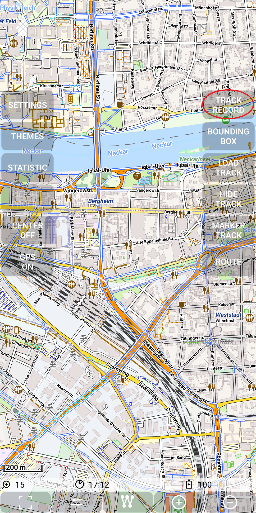
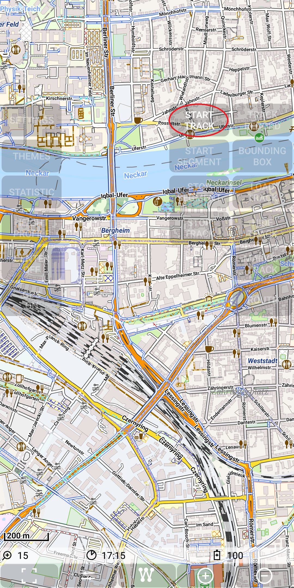

## Main Track Feature: record a track

Start track recording with
Menu | 
[Track Record](./MenuM_Track.png ) |
[Start Track](./MenuTrackStart.png).

&nbsp;
&nbsp;
&nbsp;

Move a little bit around 

&nbsp;

and then stop recording with 
Menu | 
[Track Record](./Track_Record_2.png ) |
[Stop Track](./Track_Record_3.png).

&nbsp;
&nbsp;

After the stop recording action this track becomes the "selected track":
 
&nbsp;
&nbsp;

The second screen is after zoom in two steps.

Each green segment represents the line between 2 successive recorded points. The small inner (gray) line 
points in the direction of moving. The color green represents the fact, that the area is flat, so the 
track is neither ascending nor descending.

If you use instead of "Stop Track" the "Stop segment" button, then you can continue the track recording later
with the "Start Segment" Button. So the track consists of a number of segments, which is typically just 1.

