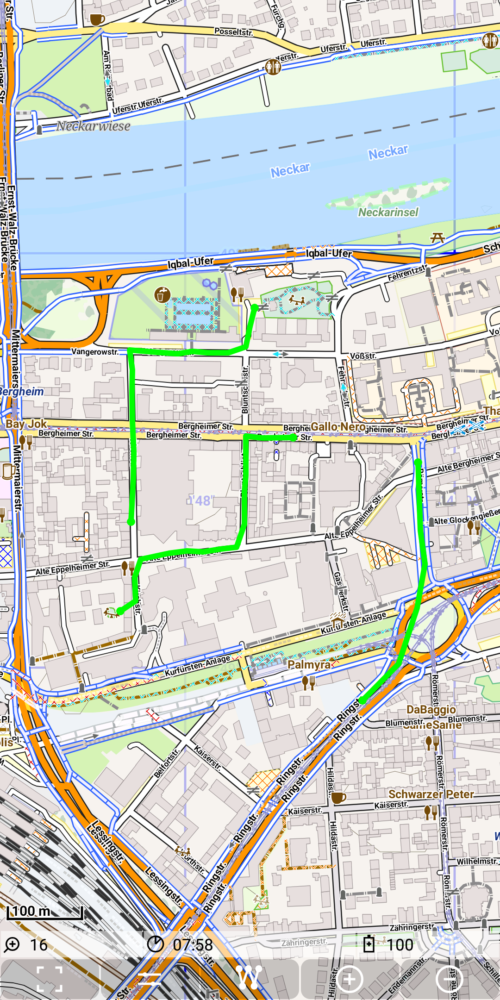
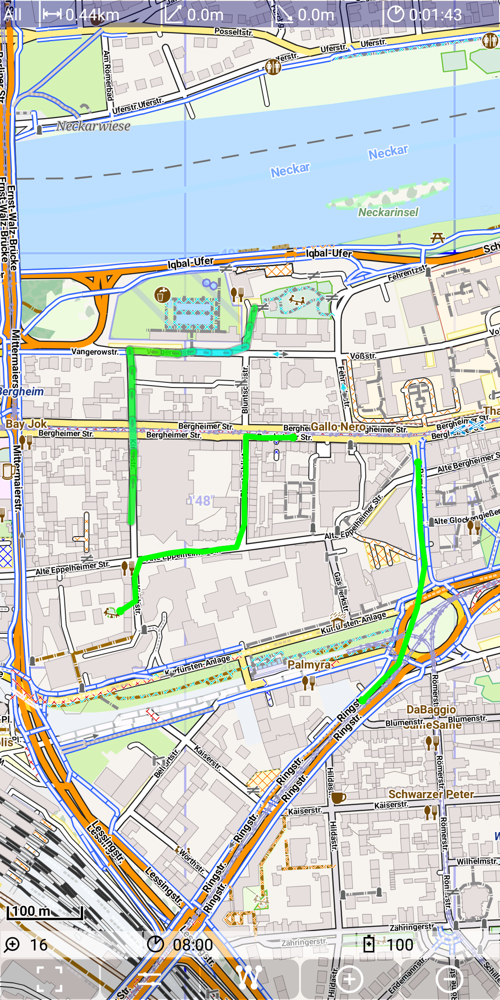
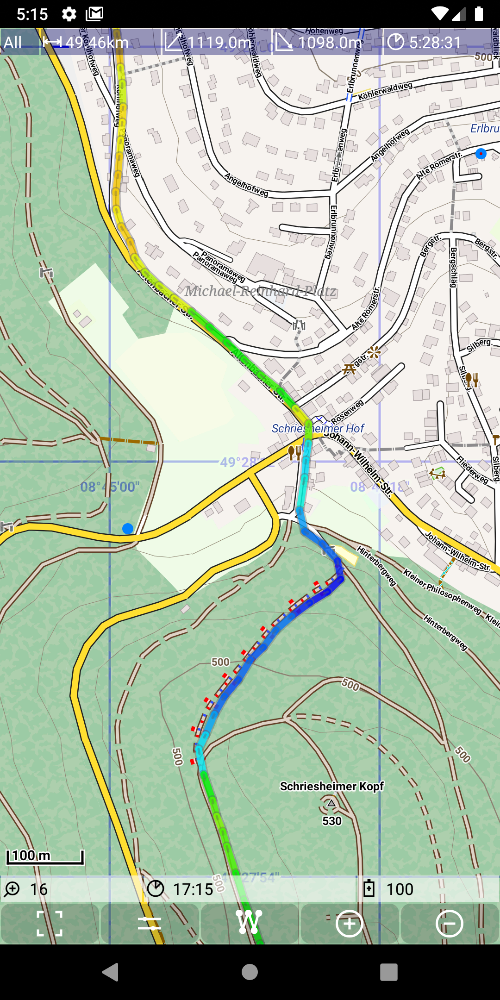
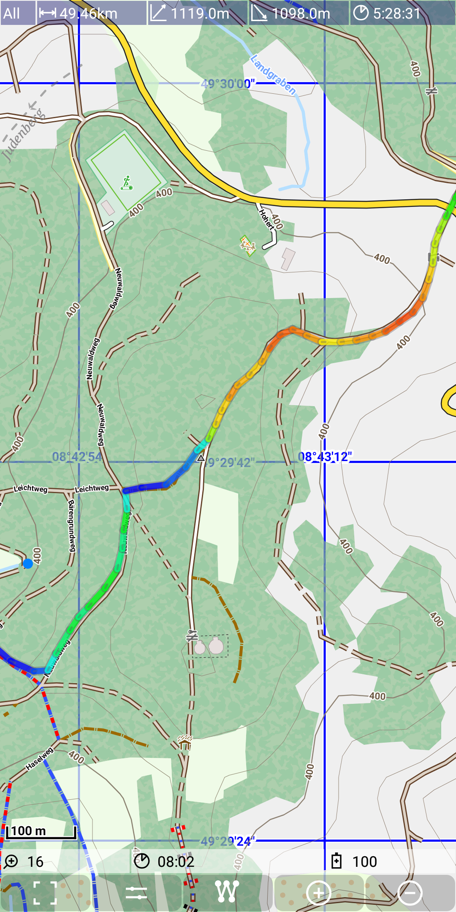

## Main Track Feature: track visualisation

The visualization of track is a one important feature of this app. 
The track visualization is done by drawing a colored line over visible map layers.

A track is represented by a TrackLog object - please check the [track definitions](../../track.md).

The following pictures show:
- a RecordingTrackLog (red line)
- multiple available tracks (green lines)
- multiple available tracks (green lines) and a selected track (blue line)

&nbsp;
&nbsp;
&nbsp;

- multiple available tracks (green lines) and a selected track 
 (colored depending on gain/loss - green due to flat area)
- a selected track (colored depending on gain/loss)
  - drak blue: steep descending
  - light blue: moderate descending
  - green: not ascending/descending
  - yellow: moderate ascending
  - red: steep ascending
- another selected track (colored depending on gain/loss)

&nbsp;
&nbsp;
&nbsp;

**Track selection**

There are multiple options to make a track the selected track:
- If there is more than one available track, then tap on a track and this track becomes the new selected track.
- Other options are the Menu | Load Track | Prev and Menu | Load Track | Next to get the previous/next track (from the set of MetaTrackLogs).
- Finally there is an option from the track statistics activity to choose a new selected track. 

