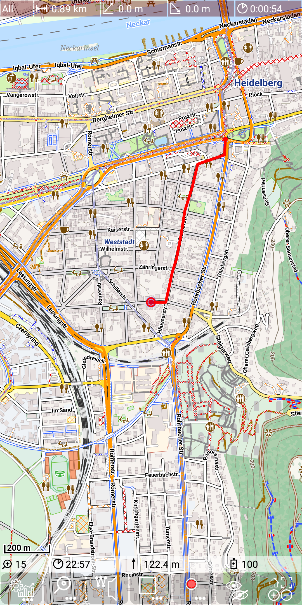
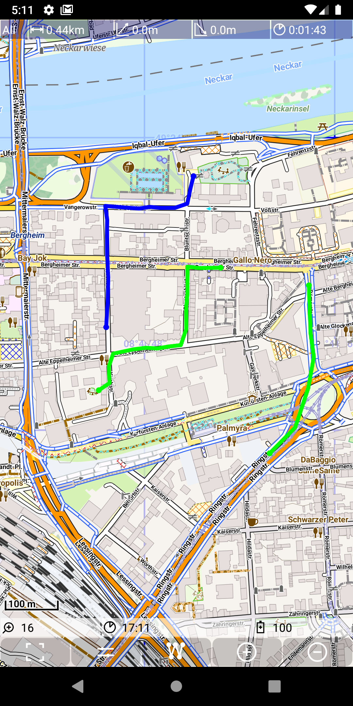
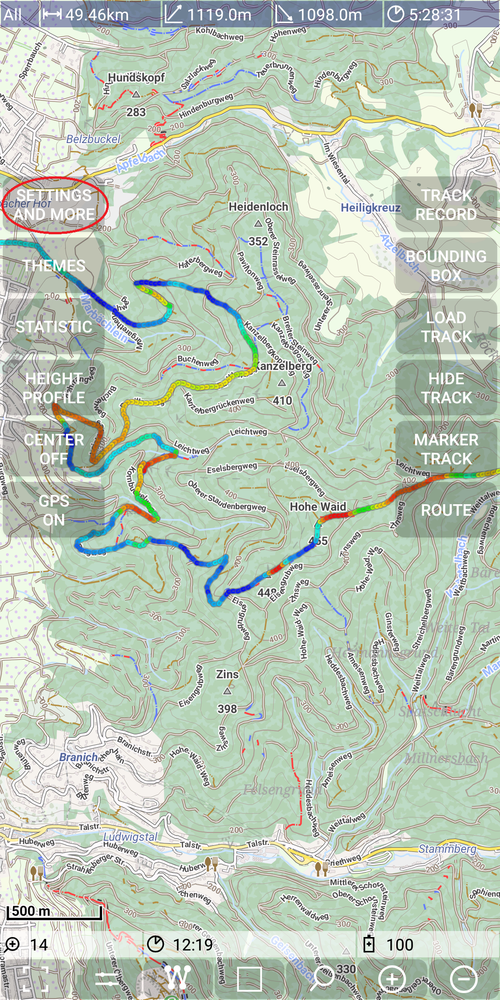
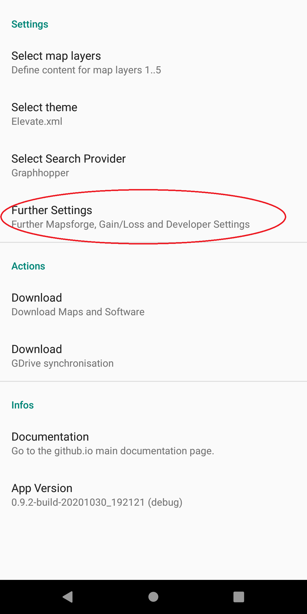
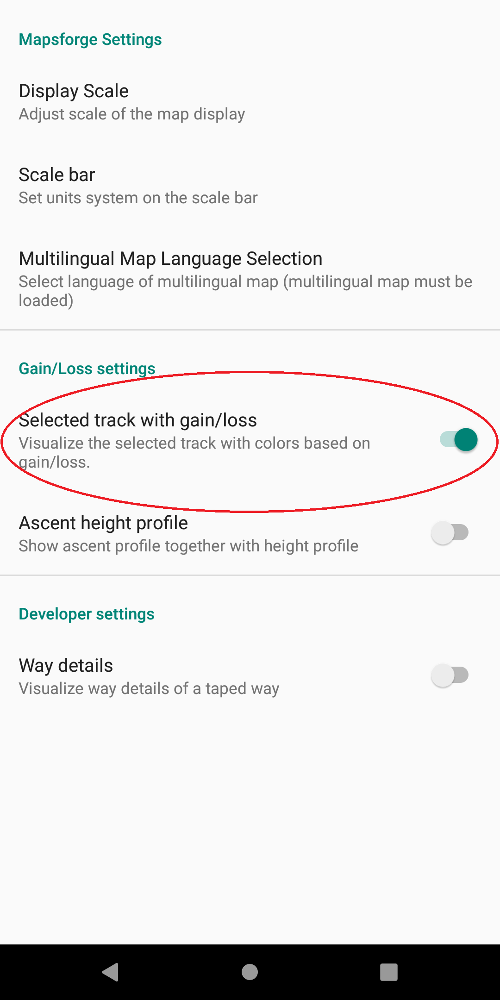

## Main Track Feature: track visualisation

The visualization of tracks is a one important feature of this app. The
track visualization is done by drawing a colored lines on top of the
visible map layers.

A track is represented by a TrackLog object - please check the [track definitions](../../track.md).

The following pictures show:
- a RecordingTrackLog (red line)
- multiple available tracks (green lines) and a selected track (blue line)

&nbsp;
&nbsp;

For the selected track there are two main options:
- visualize the selected track as blue line (as seen above)
- visualize the selected track colored depending on gain/loss (see next
  picture)

&nbsp;

Colored depending on gain/loss means
- drak blue: steep descending
- light blue: moderate descending
- green: not ascending/descending
- yellow: moderate ascending
- red: steep ascending

To toggle the setting "Selected Track with Gain/Loss" use
*Menu | Settings and more | Further Settings | Selected Track with Gain/Loss*

&nbsp;
&nbsp;
&nbsp;

**Track selection**

There are multiple options to make a track the selected track:
- If there is more than one available track, then just tap on a track and this track becomes the new selected track.
- Use the *Menu | Load Track | Prev* and
  *Menu | Load Track | Next* to get the
  previous/next track (from the set of MetaTrackLogs). This corresponds to the set of known tracks sorted by name.
- Use the track statistics activity and choose a
  new selected track via the context menu entry "Select Track" of the track.

