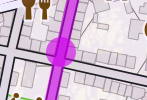
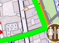
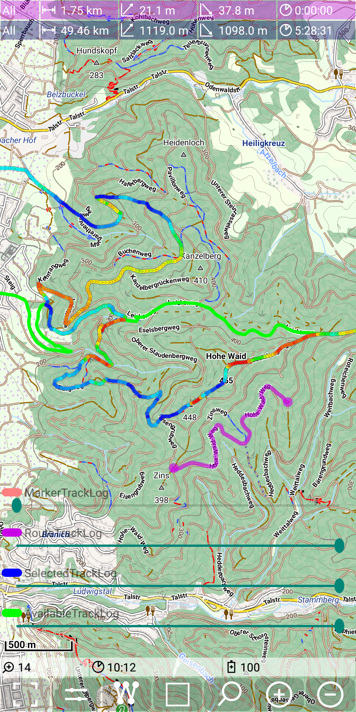
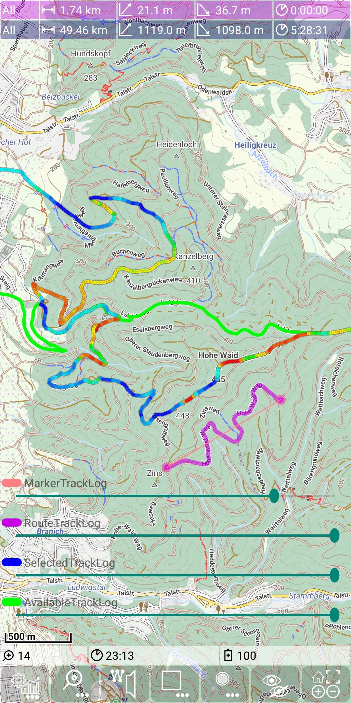
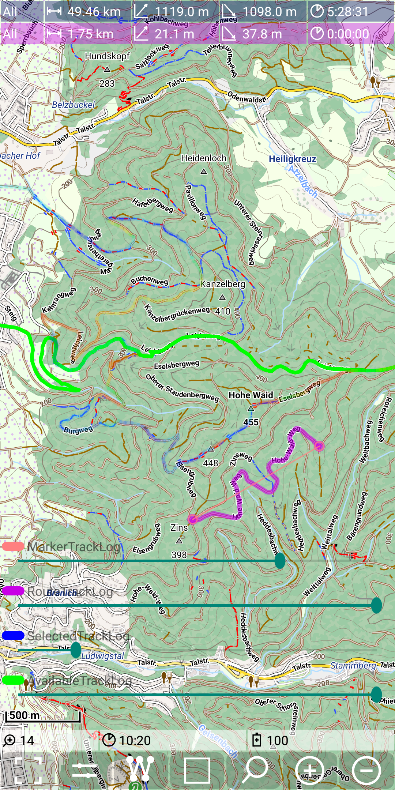

<small><small>[Back to Index](../../../index.md)</small></small>

## Main Track Feature: track visualisation

The visualization of tracks is a one important feature of this app. The
track visualization is done by drawing colored lines on top of the
visible map layers.

A track is represented by a TrackLog object - please check the [track definitions](../../track.md).

The following pictures show:
- a RecordingTrackLog (red line)
- multiple available tracks (green lines) and a selected track (blue line)

&nbsp;
&nbsp;

Beside these three types of visualized tracks there might be also a [marker track](../MarkerTrack/markertrack.md) ( pink line) and
a [route track](../Routing/routing.md) (purple line) visible.
Out of these 5 types of tracks there are three of them (recording track, route track and selected track),
which allow an alternative gain/loss representation of this track.

The following picture shows an selected track with gain/loss representation switched on.

&nbsp;

Colored depending on gain/loss means
- drak blue: steep descending
- light blue: moderate descending
- green: not ascending/descending
- yellow: moderate ascending
- red: steep ascending

Use the [Statistic activity](../../FurtherFeatures/Statistic/statistic.md) to load tracks as available, selected and marker track.

### Controls for track visualization

#### Track controls

<table style="font-size: small">
<th width="12%" style="text-align:center; min-width:60px; max-width:60px"> </th>
<th width="17%" style="text-align:center; min-width:100px"></th>
<th width="17%" style="text-align:center; min-width:100px"></th>
<th width="17%" style="text-align:center; min-width:100px"></th>
<th width="17%" style="text-align:center; min-width:100px"></th>

<tr>
    <td>short tap</td>
    <td> </td>
    <td>when  on point: delete point on line: insert new point </td>
    <td> </td>
    <td>make this track to the selected</td>
</tr>
<tr>
    <td>long tap</td>
    <td>toggle gain/loss mode</td>
    <td>when  toggle gain/loss mode  
        when  on point: toggle gain/loss mode on line: toggle direct route </td>
    <td>toggle gain/loss mode</td>
    <td> </td>
</tr>
</table>

#### Track transparency
It is possible to control the transparency for all track types. To do this use
 + .
The next figures show an example of the usage: First the marker track is invisible, while in the second figure the transparency of the marker track is reduced, so it becomes well visible.

&nbsp;
&nbsp;

As a second example we increase transparency of the selected track. So the other available (green) track becomes much better visible and also the map properties are better visible.

&nbsp;

There is no control for the recording track log visible, since there is currently no recording track. Switch off the track transparency controls again with
 + .

<small><small>[Back to Index](../../../index.md)</small></small>

