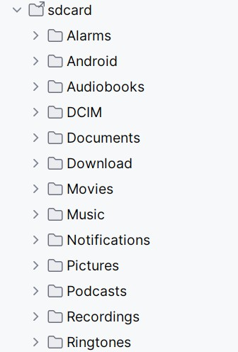

<small><small>[Back to Index](../index.md)</small></small>

## Getting Started: File system information


1. Storage location: The main storage location of this app is  
   `/sdcard/Andorid/data/<flavorType>/files/MGMapViewer`  
   where `sdcard` is not a real sdcard. It's rather the default external storage location of Android. 
   Typically it's a symlink to `/storage/self/primary`, which again is a symlink to `/storage/emulated/0`.
   Depending on your device there might be diffetent names. In any case it has following typpical layout:
   
      &nbsp;

   
   The \<flavorType\> is depending on your installation one of these values
      - de.soft4mg.mgmap.rel (official playstore variant)
      - de.soft4mg.mgmap     (debug version of playstore flavor - apk only installable via AndroidStudio)
      - mg.mamap.rel         (release version of apk from mg4gh github page)
      - mg.mamap             (debug version of apk from mg4gh github page)
   
   Remember the storage location, you might need it. Blame Google, if you don't like it :-)

   Keep in mind that the uninstall of the app deletes this directory including all data!  
   With each Android version it became more difficult to access this location with a file manager on the device. Now (Android 15) access doesn't work any longer. 
   
   With a USB cable connected to your device you can access the /sdcard folder - on a PC this folder is shown as the "root" folder of your device.
   
   But there is also a good news: There is a new feature [file manager](../Features/FurtherFeatures/FileManager/filemanager.md). It allows you to show, edit,
   share and delete all files as needed.


2. The app creates below the MGMapViewer directory new subdirectories:
```
   MGMapViewer/apk/                          // to store downloaded apk
              /backup                        // backup and restore related data
                     /backup                 // contains backup related files
                     /restore                // contains restore related files
              /config/                       // configuration data
                     /search/                // search configuration data
              /hgt/                          // store hgt height data files
              /log/                          // store log files
              /maps/                         // store map related data
                   /mapsforge/               // store mapsforge maps - unzipped
                   /mapstores/               // store offline tile stores
                   /maponline/               // store descriptions for online tile stores
                   /mapgrid/                 // store description files for grid map layers
              /themes/                       // store themes for mapsforge maps
              /track/                        // store track related data
                    /gpx                     // store tracks in .gpx format
                    /meta                    // store meta data of tracks - statistics and bounding box 
                                             //    information on a set of latitude/longitude values
                    /recording               // store all data of the currently recording track - enables 
                                             //    to continue recording after app or device restart
```

<small><small>[Back to Index](../index.md)</small></small>