<small><small>[Back to Index](../index.md)</small></small>

# Getting Started: First Usage of MGMapViewer

1. Just start the app the first time. In the bottom you see the menu quick controls and above the status line with very few information. 
   Additionally you see the initial map download hint.  
   &nbsp;

   Once you read and understood this, you can close the hint with the "Got it" button. 
   Since the checkbox *Don't show this hint anymore*
   is checked, you'll see this hint only once.
 
2. As the hint advised use  and 
   to open the download preference screen. Select e.g. *Germany* to open the download webpage of openandromaps for germany. 
   Before the browser opens you'll see the next hint. Read it carefully and click again the "Got it" button.  
   &nbsp;
   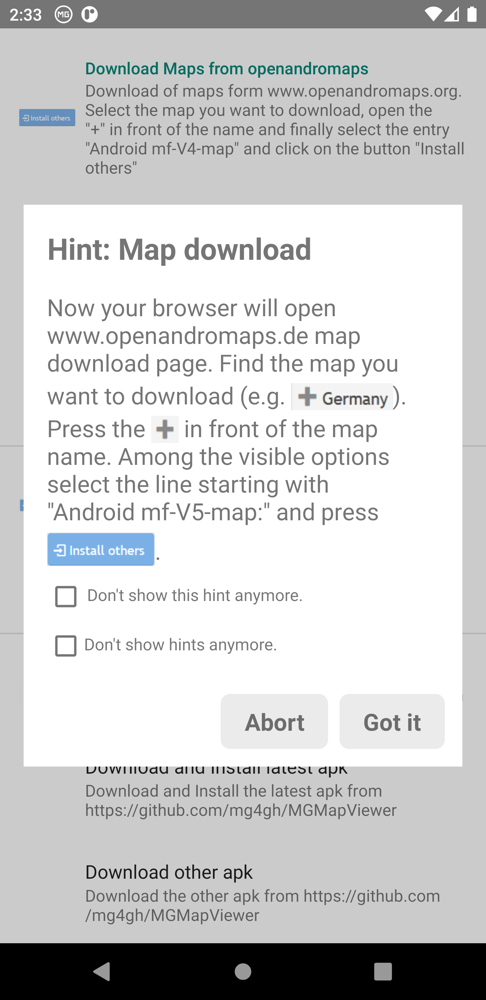&nbsp;

3. If you want to download e.g. the map of Berlin, then scroll a bit down press the "+" button in front
   of "Berlin", now select the  *Install others* entry with the prefix
   *Android mf-V5-map*.  
   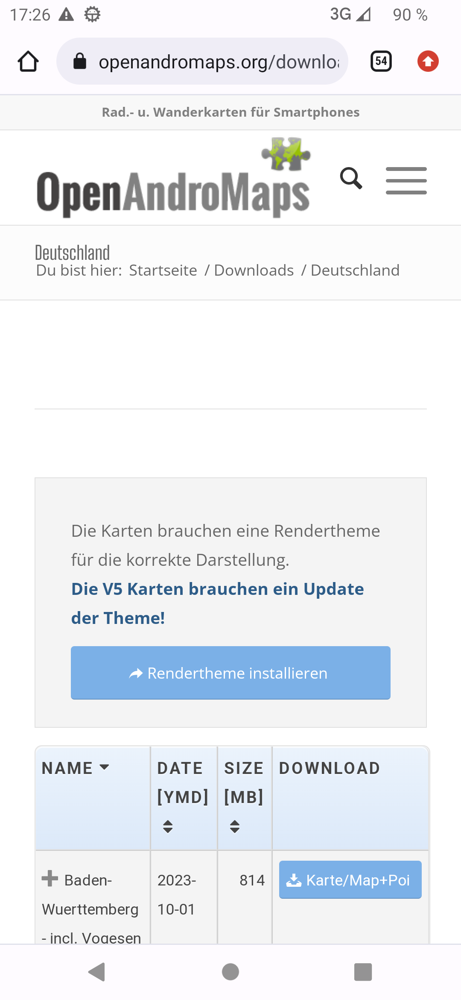&nbsp;
   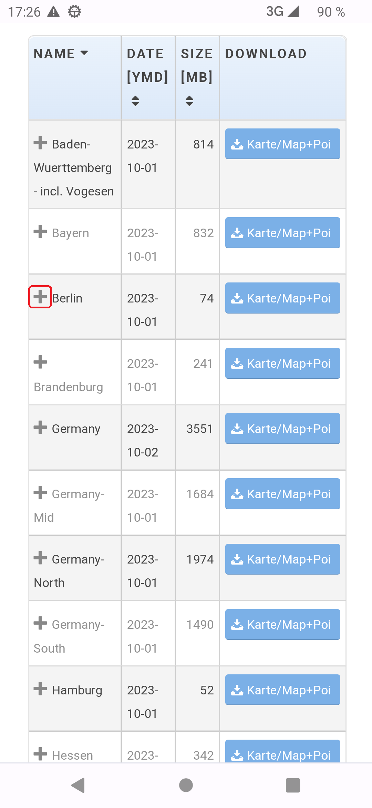&nbsp;
   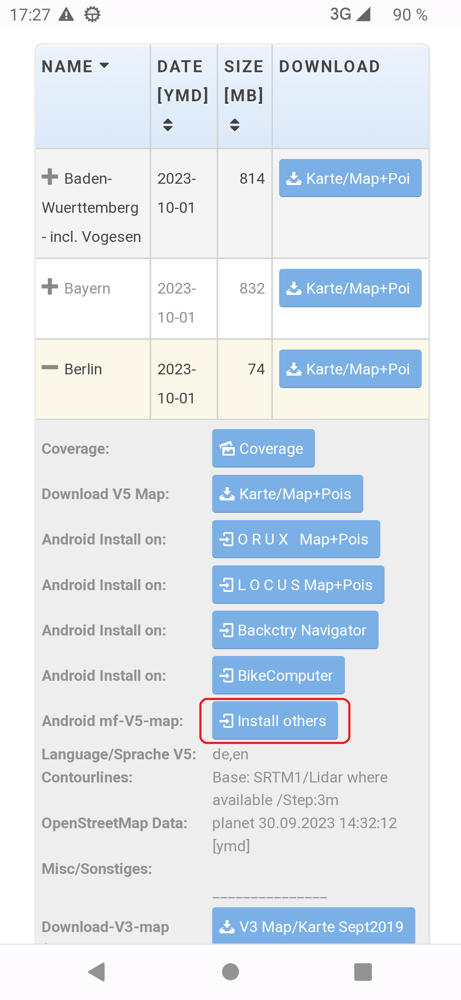&nbsp;

4. With this click the MGMappViewer app opens again and you will be ask to confirm the download of the requested map.
   The download itself may take some time (depending on the map size and your internet speed). For long lasting downloads there is a 
   countdown of the remaining download effort in the status line visible.
   Once the download is finish you'll see the result and that you can assign the map now to a layer.  
   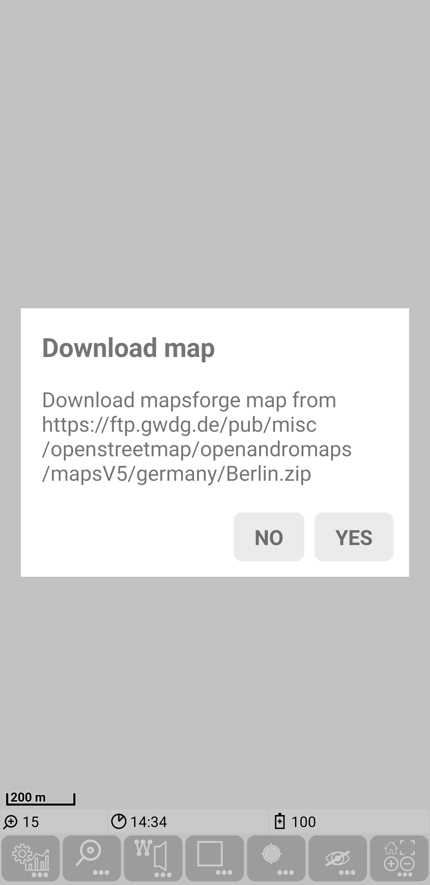&nbsp;
   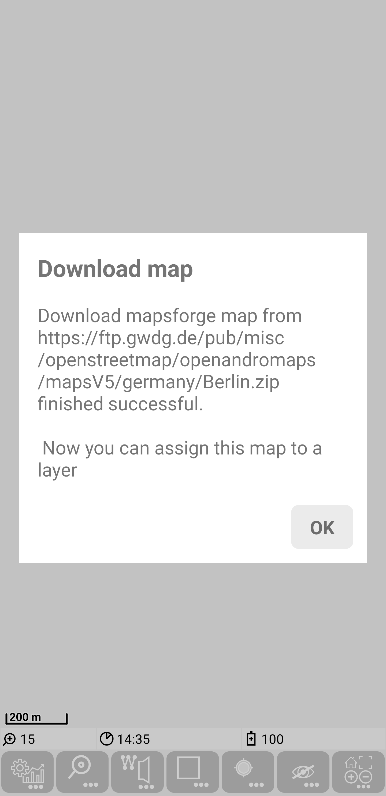&nbsp;

5. After the "OK" on the map download results the app opens automatically the map layer assignment screen and the 
   map layer assignment hint. Read the instruction and follow it. Click on *Select map layer 2* and then select the 
   *MAPSFORGE: Berlin_oam.osm.map* entry. Now this map is assigned to layer 2. Use the Android
   *Back* button to go back the the main activity.

   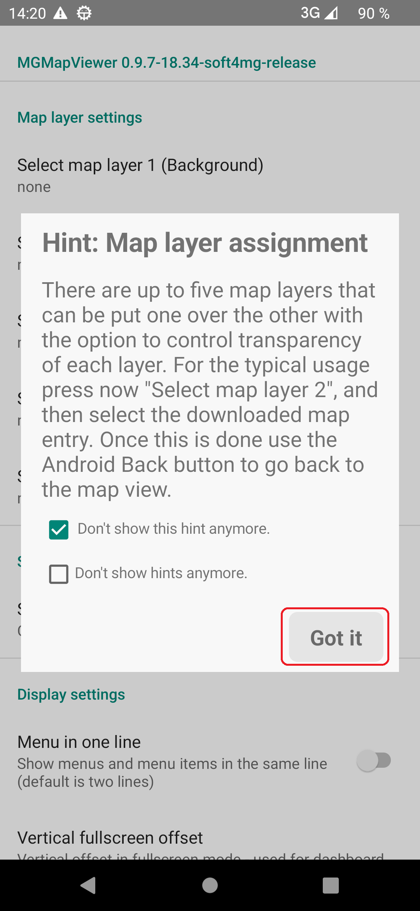&nbsp;
   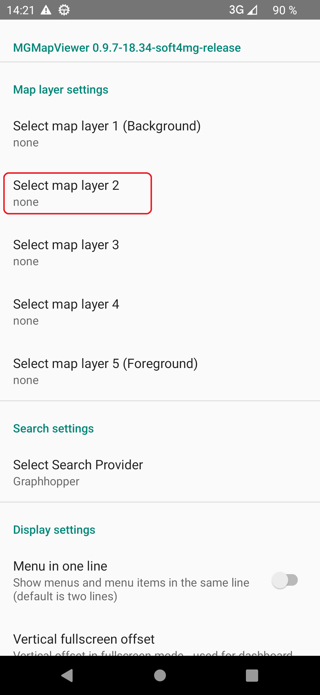&nbsp;
   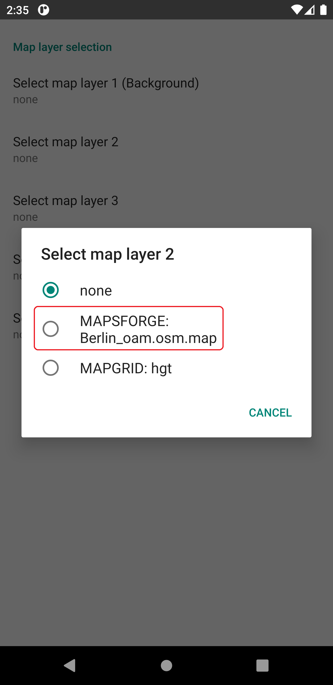&nbsp;
   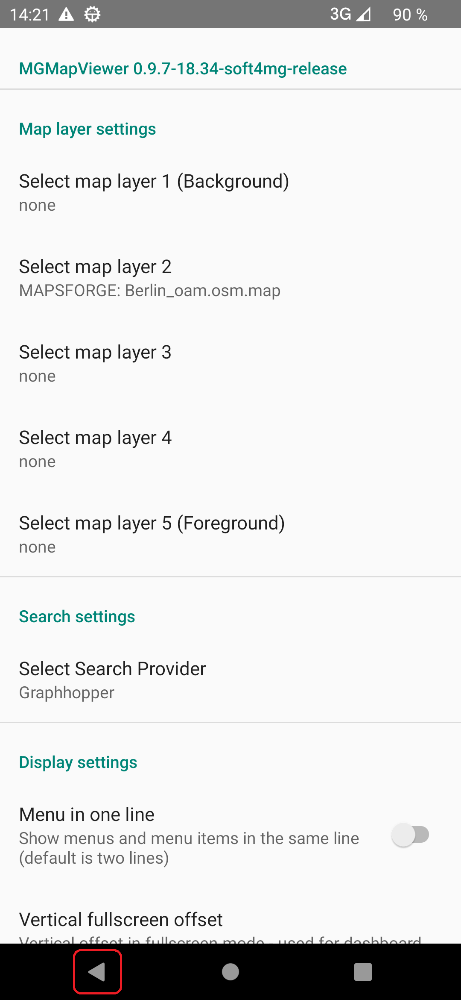

6. Back in the main MGMapActivity you will be asked to download the corresponding height data. Confirm this and also the result of the download.  
   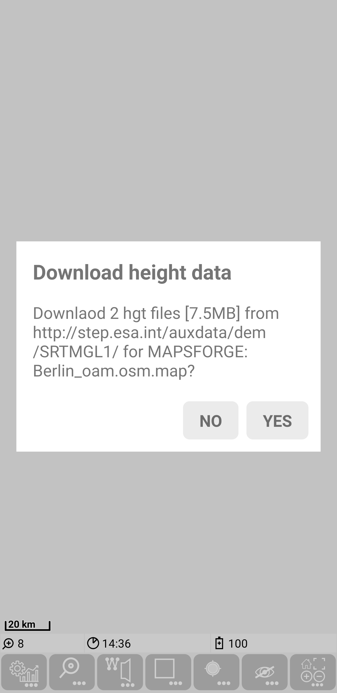&nbsp;
   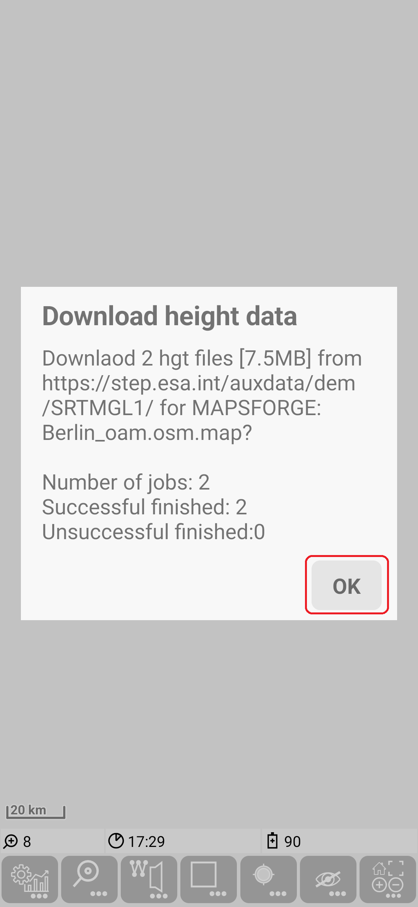&nbsp;
   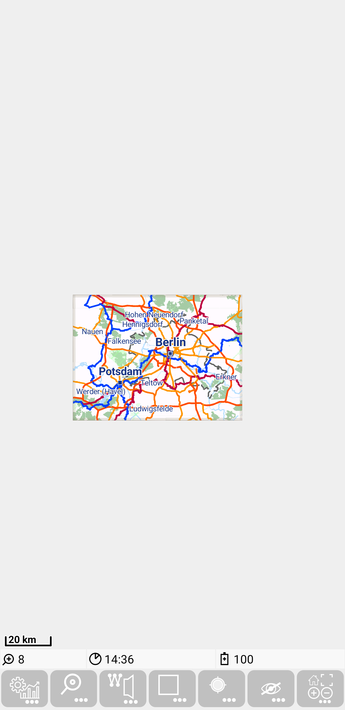&nbsp;

   Congratulations! - the first map is visible.

7. Power Saving: If you are using track recording on Android&nbsp;10, then it is recommended to switch on the option "Ausgenommen vom Energiesparen" for this app.
   On a LG device with Android&nbsp;10 you can reach this Option via
      - "Einstellungen / Akku / Ausgenommen vom Energiesparen" or
      - "Einstellungen / Apps & Benachrichtigungen / Besonderer Zugang / Ausgenommen vom Energiesparen".

   Otherwise it might happen, that Android is killing the
   background service and the track recording will only continue after the next usage of the app.

<small><small>[Back to Index](../index.md)</small></small>
