<small><small>[Back to Index](../index.md)</small></small>

# Getting Started: Installation and first Usage of MGMapViewer

1. Copy apk to the device. 
Either take a prebuild apk from the directory [./MGMapViewer/apk](https://github.com/mg4gh/MGMapViewer/tree/master/apk) of this project or download the source code
and use AndroidStudio to build the whole project. Once you decide to take the debug version, you have to update always with the debug version. Vice versa, if you take the
release version, you need always this version for updates. A change between debug and release is only possible after an uninstall of the app!
2. Select the file in the file explorer and just tap on it.
Make sure that the permission for local app installation is given to the file explorer.
3. Just start the app.
Don't be disappointed, since you'll see only an almost empty screen, 
except the menu quick controls and the status line with very few information.

   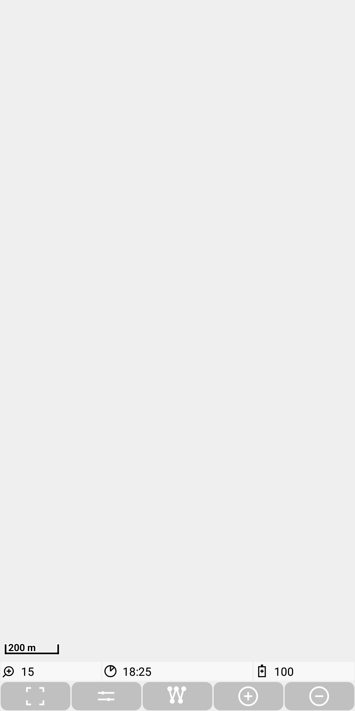&nbsp;

5. Now download a map from [openandromaps](https://www.openandromaps.org/).
   Either do it manually and put it (unzipped) in the ./MGMapViewer/maps/mapsforge directory (see also [file system structure](./FileSystem.md)).  
   The easier way is again via  and 
   to open the download preference screen. Select *Germany* to open the download webpage of openandromaps for germany.

   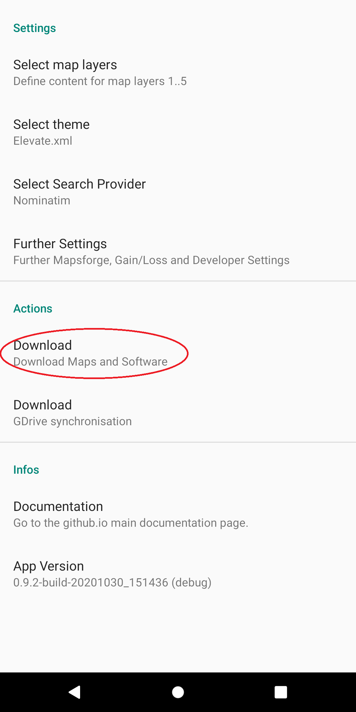&nbsp;
   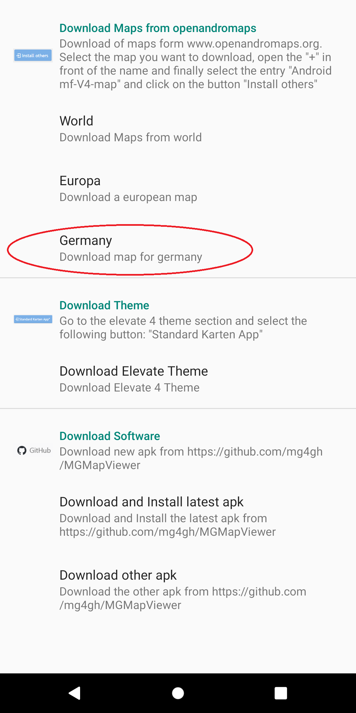&nbsp;

   If you want to download e.g. the map of Berlin, then press the "+" button in front
   of "Berlin", now select the  *Install others* entry with the prefix
   *Android mf-V4-map*. This will trigger the download process. If the download
   takes some time, the progress can be observed via the corresponding notifications.
   
   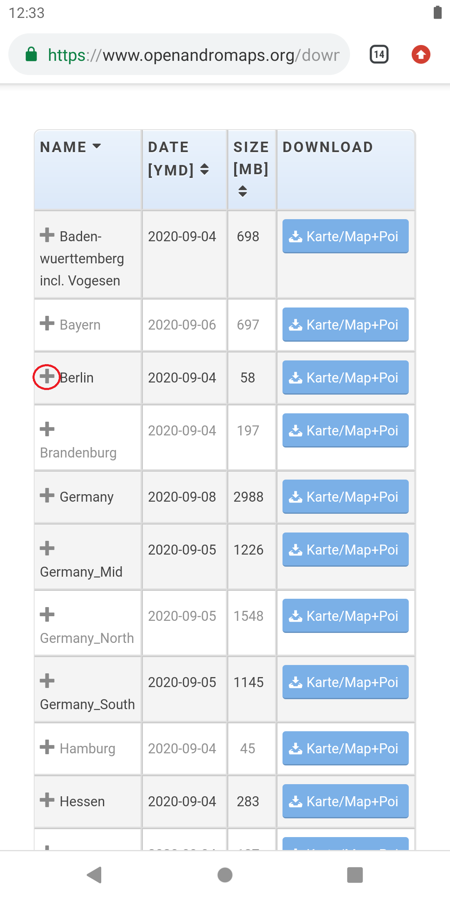&nbsp;
   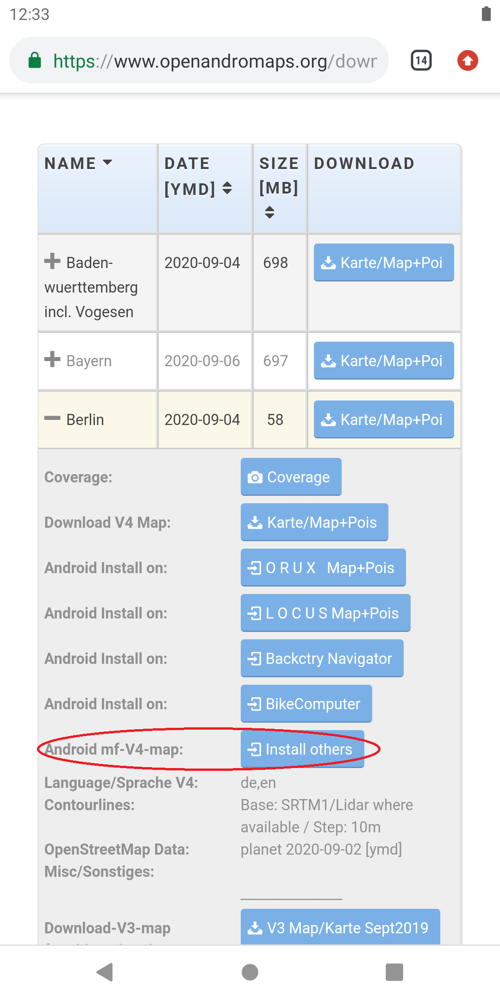&nbsp;

   Tap again on the Task menu  and then on the settings action .
   Then select the downloaded map via *Select map layers | Select map layer 2*.

   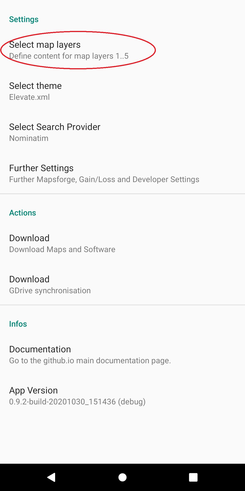&nbsp;
   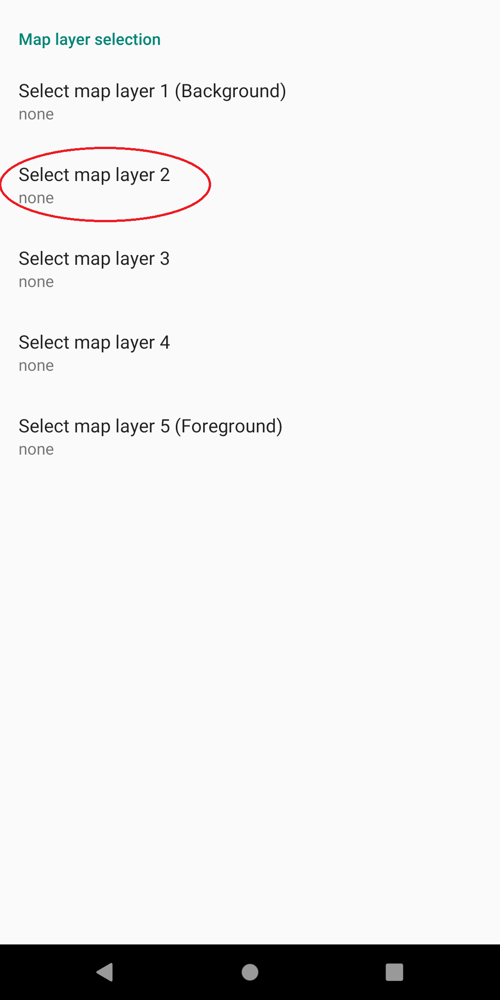&nbsp;
   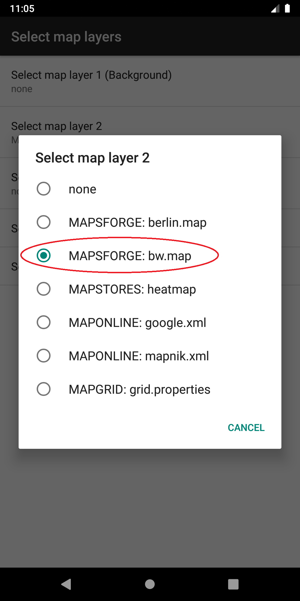

   Now use twice the *Back* button and you'll see the first map.

   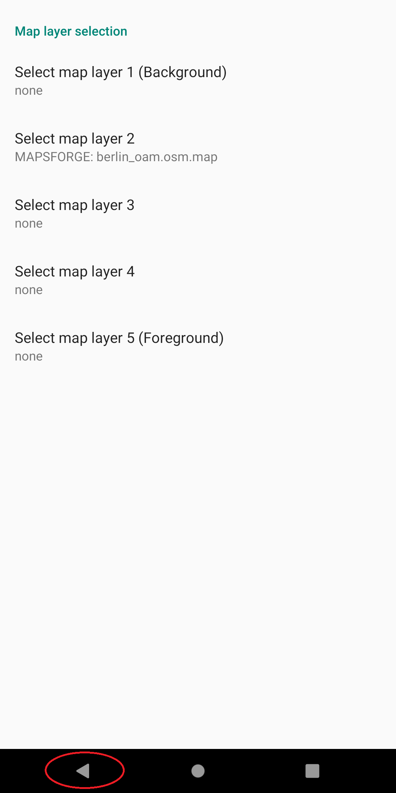&nbsp;
   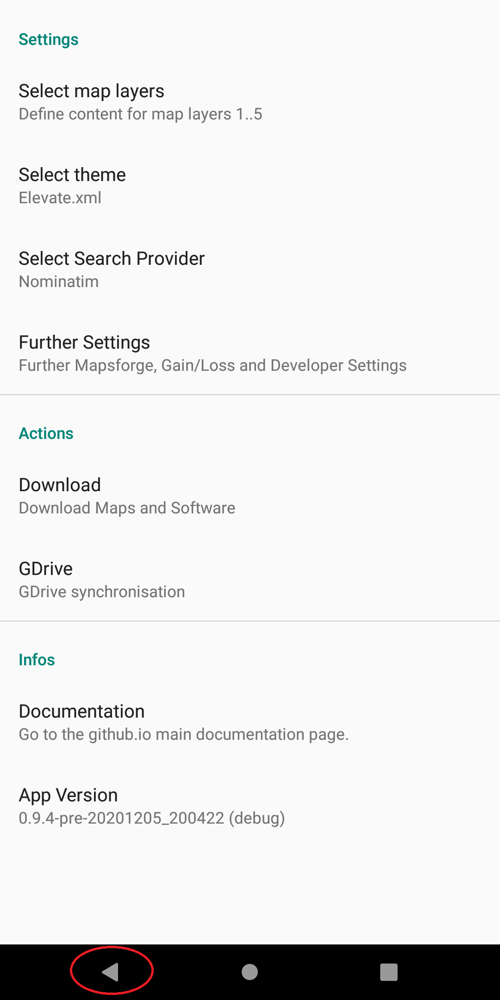&nbsp;
   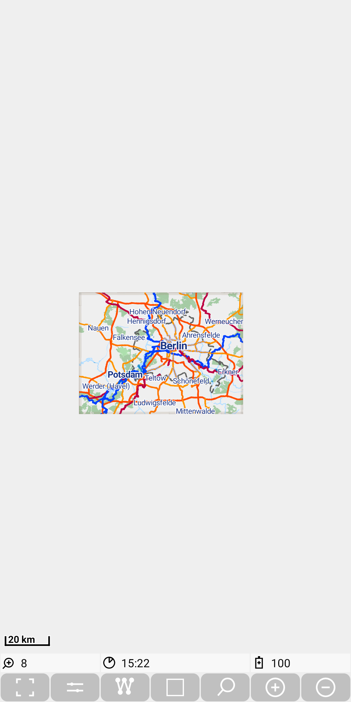&nbsp;

6. Have a look to the [mapsforge themes](../Features/MainMapFeatures/MapsforgeThemes/mapsforgethemes.md) section
to adopt the map to your needs.

7. Power Saving: If you are using track recording on Android&nbsp;10, then it is recommended to switch on the option "Ausgenommen vom Energiesparen" for this app.
    On a LG device with Android&nbsp;10 you can reach this Option via
      - "Einstellungen / Akku / Ausgenommen vom Energiesparen" or
      - "Einstellungen / Apps & Benachrichtigungen / Besonderer Zugang / Ausgenommen vom Energiesparen".

    Otherwise it might happen, that Android is killing the
    background service and the track recording will only continue after the next usage of the app.

Congratulations!

<small><small>[Back to Index](../index.md)</small></small>
