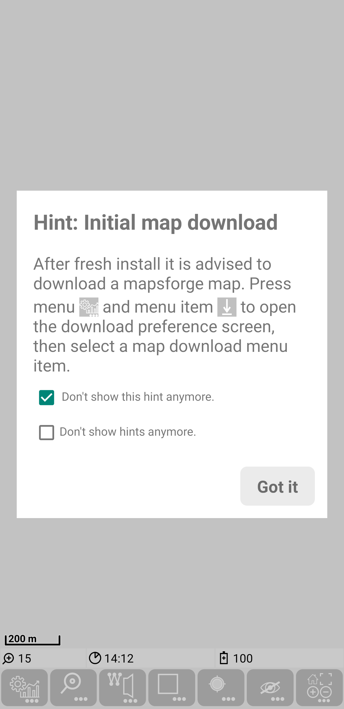
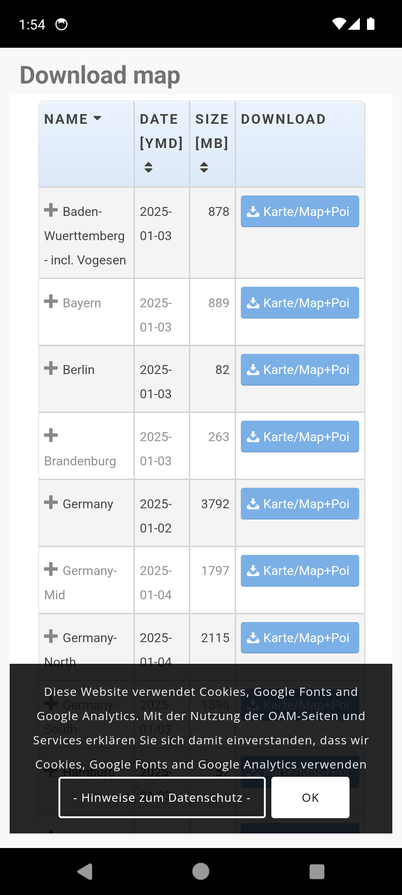
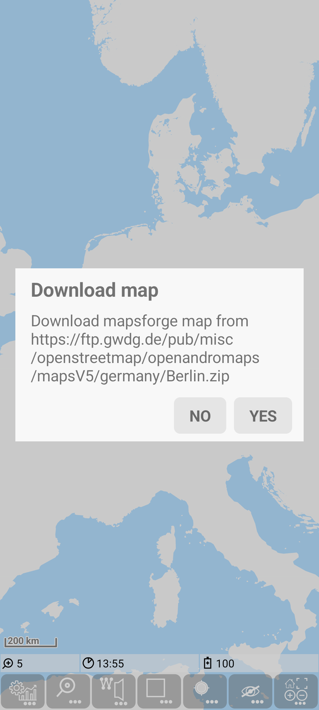
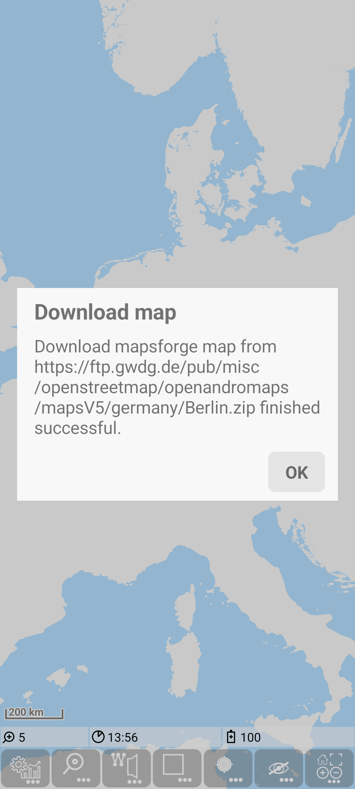
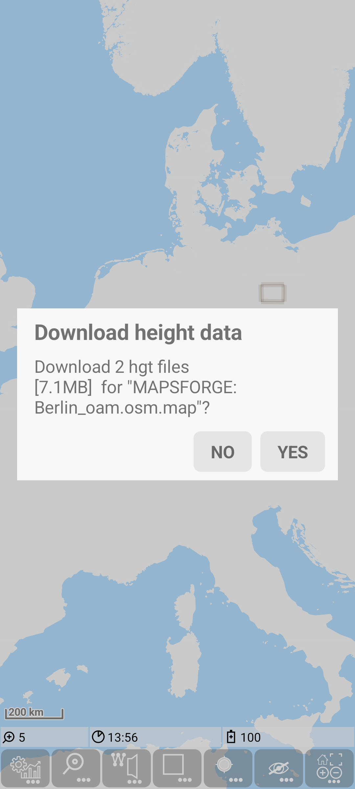
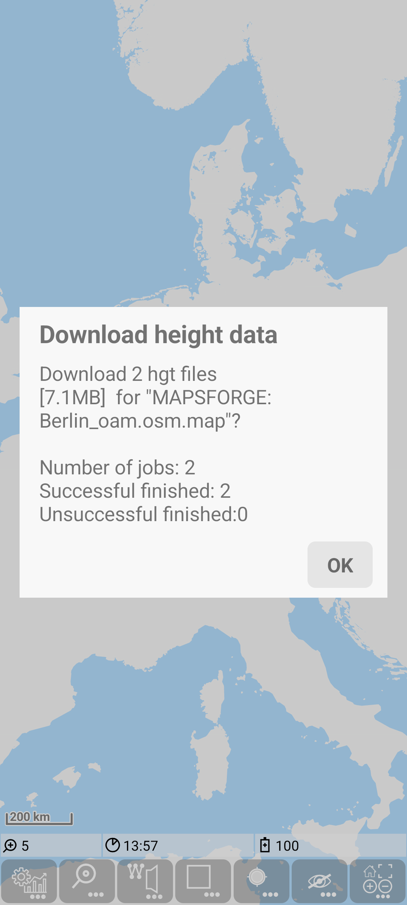
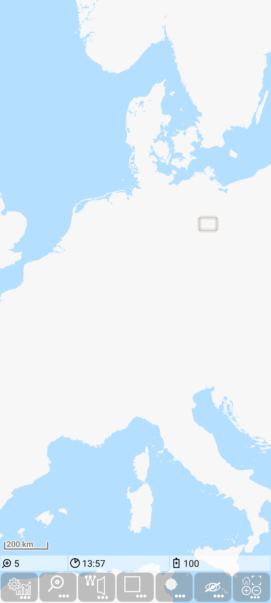
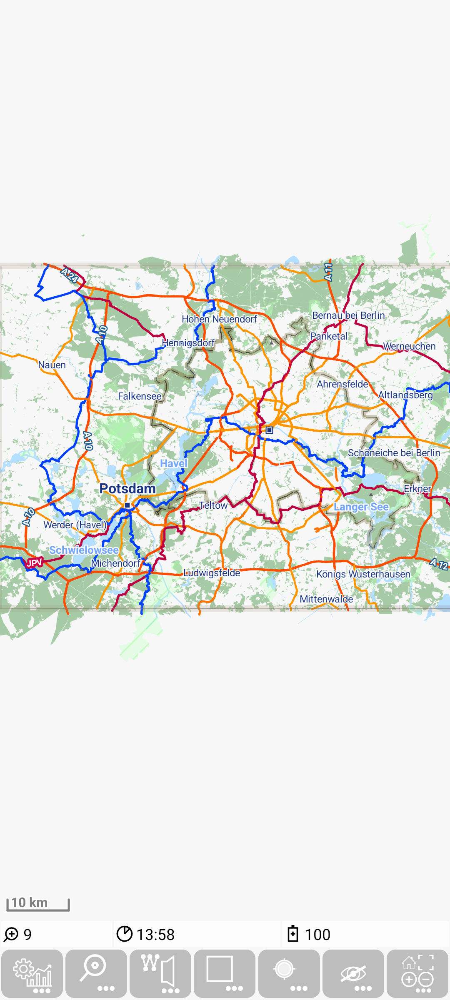
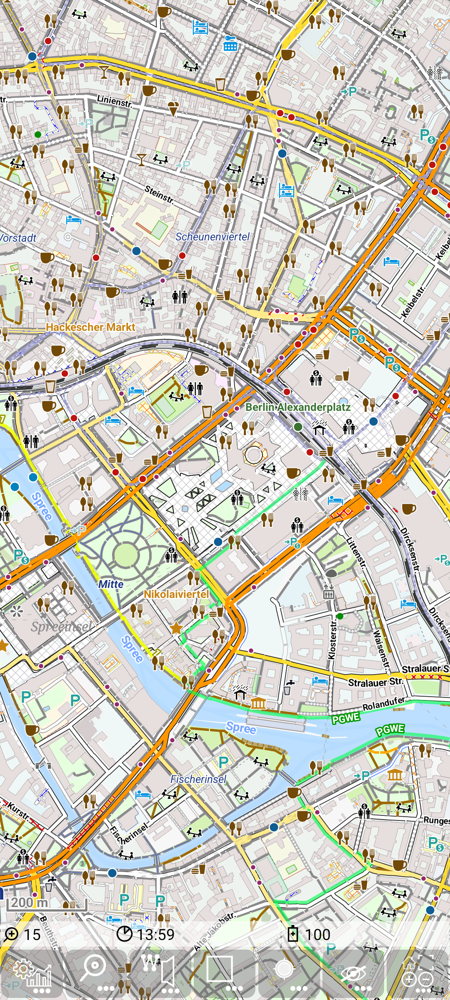

<small><small>[Back to Index](../index.md)</small></small>

# Getting Started: First Usage of MGMapViewer

Just start the app the first time. In the bottom you see the menu quick controls and above the status line with very few information. 
   In the background you see a world map, which contains mainly the land/see areas.
   Additionally you see the initial map download hint.
   Once you read and understood this, you can close the hint with the "Got it" button. 
 
As the hint advised use  and 
   to open the download preference screen. Select e.g. *Germany* to open the download webpage of openandromaps for germany. 

   &nbsp;
   &nbsp;

If you want to download e.g. the map of Berlin, just press the *Karte/Map+Poi* button in the Berlin row.

   &nbsp;

With this click you return to the map view and you will be ask to confirm the download of the requested map.
   The download itself may take some time (depending on the map size and your internet speed). For long lasting downloads there is a 
   countdown of the remaining download effort in the status line visible.
   Once the download is finish you'll see the result.  
   
   &nbsp;
   &nbsp;

Now you will be asked to download the corresponding height data. Confirm this and also the result of the download. 
 
   &nbsp;
   &nbsp;
   
Now the Berlin map is successfully loaded, just zoom in (by double tap or gesture) to see more.

   &nbsp;
   &nbsp;
   &nbsp;

Congratulations! - thats all.

<small><small>[Back to Index](../index.md)</small></small>
