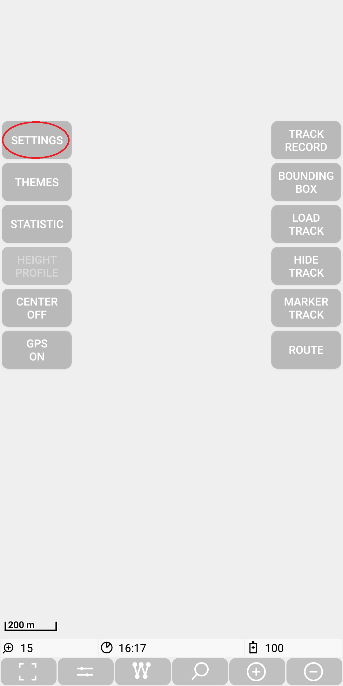
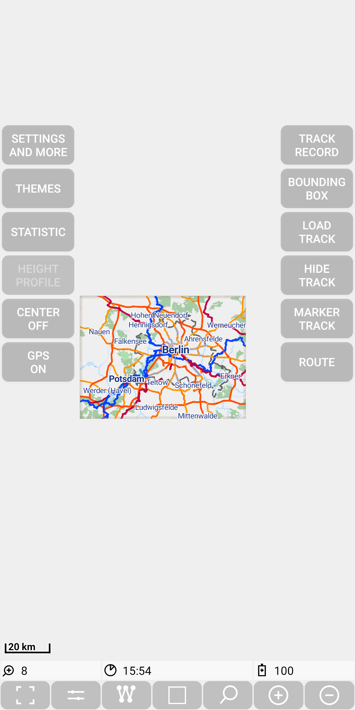
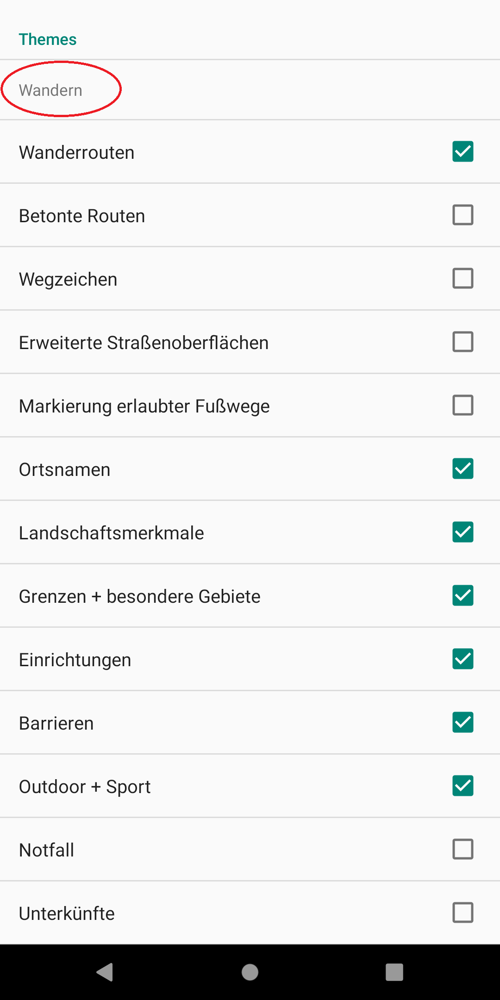
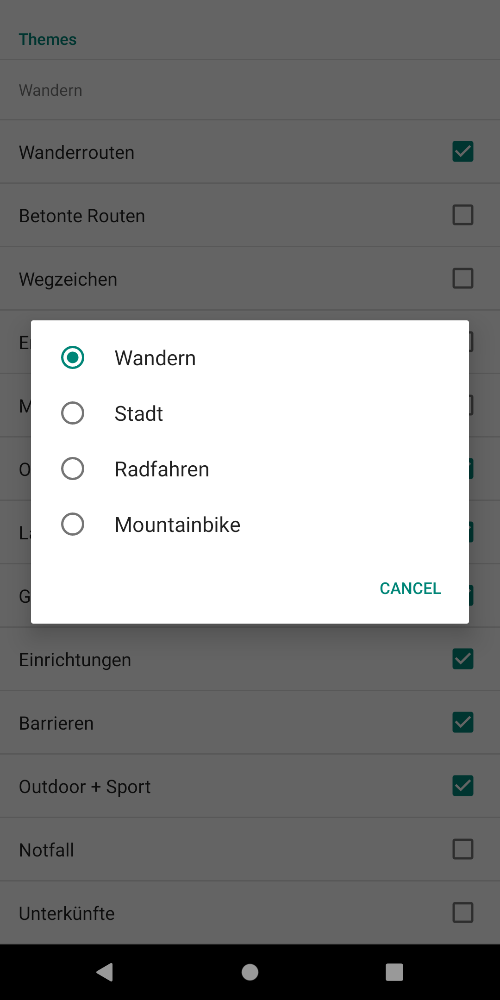

<small><small>[Back to Index](../index.md)</small></small>

# Getting Started: Installation and first Usage of MGMapViewer

1. Copy apk to the device. 
Either take a prebuild apk from the directory [./MGMapViewer/apk](https://github.com/mg4gh/MGMapViewer/tree/master/apk) of this project or download the source code
and use AndroidStudio to build the whole project. Once you decide to take the debug version, you have to update always with the debug version. Vice versa, if you take the
release version, you need always this version for updates. A change between debug and release is only possible after an uninstall of the app!
2. Select the file in the file explorer and just tap on it.
Make sure that the permission for local app installation is given to the file explorer.
3. Just start the app.
Don't be disappointed, since you'll see only an almost empty screen, 
except the menu quick controls and the status line with very few information.

   &nbsp;

4. Storage location: The main storage location of this app is  
  `/<sdcard>/Andorid/data/mg.mgmap/files/MGMapViewer`  
  where \<sdcard> is not necessarily a real sdcard. It's rather the default external storage location. Often the path is "/storage/emulated/0".
  Sometimes the term "internal storage" is used. Keep in mind 
  that the uninstall of the app deletes all data!  
  Remember the storage location, you might need it. Blame Google, if you don't like it :-)

5. The app creates below the MGMapViewer directory new subdirectories:
    - apk (to store downloaded apk)
    - config (configuration data)
      - search (search configuration data)

    - hgt (store hgt height files)
    - log (store log files)
    - maps (store map related data)
      - mapsforge (store mapsforge maps - unzipped)
      - mapstores (directory to store offline tile stores)
      - maponline (store descriptions for online tile stores)
      - mapgrid (store description files for grid map layers)

    - themes (store themes for mapsforge maps)
    - track (store track related data)
      - gpx (store tracks in .gpx format)
      - meta (store meta data of tracks - statistics and bounding box information on a set of latitude/longitude values)
      - recording (store all data of the currently recording track - enables to continue recording after app or device restart)

5. In the typical usage scenario you provide a map from [openandromaps](https://www.openandromaps.org/).
   Either download the map manually and put it (unzipped) in the ./MGMapViewer/maps/mapsforge directory.
   Alternatively  open via *Menu | Settings and more | Download | Germany*
   the download webpage of openandromaps for germany.

   &nbsp;
   &nbsp;
   &nbsp;

   If you want to download e.g. the map of Berlin, then press the "+" button in front
   of "Berlin", now select the  *Install others* entry with the prefix
   *Android mf-V4-map*. This will trigger the download process. If the download
   takes some time, the progress can be observed via the corresponding notifications.
   
   &nbsp;
   &nbsp;

   Then select the downloaded map via  
   *Menu | Settings and more | Select map layers| Select map layer 2*

   &nbsp;
   &nbsp;
   &nbsp;
   

   Now use twice the *Back* button and you'll see the first map.

   &nbsp;
   &nbsp;
   &nbsp;

6. Additionally you have to provide a theme, which you also get via [openandromaps](https://www.openandromaps.org/).
   Download e.g. [elevate theme](https://www.openandromaps.org/wp-content/users/tobias/Elevate.zip), unzip it and
   put it into the ./MGMapViewer/themes/ directory.  
   Alternatively  open via *Menu | Settings and more | Download | Download Elevate Theme*
   the theme download webpage of openandromaps. Scroll to the Elevate 4 section and select the entry
   *Standard Karten App* entry.
   
   &nbsp;

   The "elevate.xml" is already registered as the standard theme file. If you want to select another theme,
    you can do it via  *Menu | Settings and more | Select theme*.

7. Finally go to *Menu | Themes*. Now click on the current theme to get a
  selection of the main themes. Select the most suitable theme for you.  
  Hint: If the menu entries are not visible, restart your app once.  
  &nbsp;  
     &nbsp;
     &nbsp;
     &nbsp;

8. Power Saving: If you are using track recording on Android&nbsp;10, then it is recommended to switch on the option "Ausgenommen vom Energiesparen" for this app.
    On a LG device with Android&nbsp;10 you can reach this Option via
      - "Einstellungen / Akku / Ausgenommen vom Energiesparen" or
      - "Einstellungen / Apps & Benachrichtigungen / Besonderer Zugang / Ausgenommen vom Energiesparen".

    Otherwise it might happen, that Android is killing the
    background service and the track recording will only continue after the next usage of the app.

Congratulations!

<small><small>[Back to Index](../index.md)</small></small>
