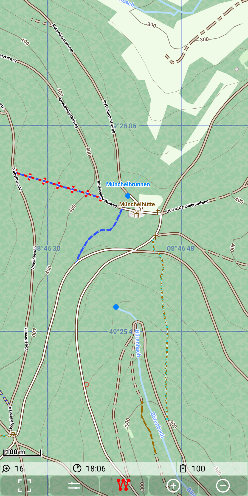

# Plan - Record - View - Share
Based on the excellent [mapsforge](https://github.com/mapsforge/mapsforge) library the **MGMapViewer** app can handle multiple map types. 
Using offline vector maps (e.g. from [openandromaps](https://www.openandromaps.org/)) you can plan, record, view and share
your tracks ... and much more.

&nbsp;&nbsp;&nbsp;

Here you can find the [Getting Started](./GettingStarted/GettingStarted.md).
For the usage please check also the [quick control sections](Features/FurtherFeatures/QuickControl/qcs_mgmapactivity.md).

# Feature overview

Each feature contains a link to the corresponding detailed feature description.
 
### Main map features
- [mapsforge](./Features/MainMapFeatures/Mapsforge/mapsforge.md): show vector maps e.g. from [openandromaps](https://www.openandromaps.org/). 
  This is the main map type for this app.
- [mapsforge themes](./Features/MainMapFeatures/MapsforgeThemes/mapsforgethemes.md): Themes provide a customisation of the layout of mapsforge maps e.g. for hiking or MTB usage. 
- [mapstores](./Features/MainMapFeatures/MapStore/mapstore.md): show maps, which are provided via an offline tile store
- [maponline](./Features/MainMapFeatures/MapOnline/maponline.md): show maps, which are provided via an online tile store (e.g. openstreetmap via Mapnik renderer)
- [mapgrid](./Features/MainMapFeatures/MapGrid/mapgrid.md): show a customizable grid from degree of latitude and longitude
- [hgt grid layer](./Features/MainMapFeatures/MapGrid/hgt.md): show a fix grid with one degree of latitude and longitude and the local availability of [Height data](./Features/FurtherFeatures/HeightData/heightdata.md)
- [Overlay multiple map layers](./Features/MainMapFeatures/MapMulti/multimap.md) and control transparency per layer (except grid)

### Main track features:
- [Track definitions](./Features/track.md): basic track definitions
- [Track visualization](./Features/MainTrackFeatures/TrackVisualization/trackvisu.md): load/show multiple tracks
- [Record a track](./Features/MainTrackFeatures/TrackRecord/trackrecord.md): recording of a track allows multiple segments
- [Track storage](./Features/MainTrackFeatures/TrackStorage/trackstorage.md):  store tracks as gpx files, but additionally store some meta data on the tracks (for faster search)
- [Bounding Box](./Features/MainTrackFeatures/BoundingBox/boundingbox.md) search tracks by marking an area (bounding box) and load all tracks through this area 
- [Basic Routing](./Features/MainTrackFeatures/Routing/routing.md) basic route calculation (shortest path) based on a marker track.
- [Dashboard](./Features/MainTrackFeatures/Dashboard/dashboard.md) visualization of the most important information of the recording, the selected and the route track log.

### Further features
- [enlarge](./Features/FurtherFeatures/Enlarge/enlarge.md) temporary a view entry (dashboard, status line) on a tap event (becomes readable without glasses)
- [toggle GPS](./Features/FurtherFeatures/GPS/gps.md) (without recording)
- [center](./Features/FurtherFeatures/Center/center.md) automatically current GPS position
- [Statistic activity](./Features/FurtherFeatures/Statistic/statistic.md): show a table of all stored tracks with basic statistic information; allows also
  to share, delete, save and trigger visualisation of tracks.
- [Height profile](./Features/FurtherFeatures/HeightProfile/hprof.md): Show the height profile form the recording track, the selected track or the current route 
- [Height data](./Features/FurtherFeatures/HeightData/heightdata.md): Provide height information for given points. This is useful for height profiles and statistics of planned routes.
- [Remaining distance](./Features/FurtherFeatures/Remaining/remaining.md): show distance along the selected track 
- [Beeline distance](Features/FurtherFeatures/BeelineDistance/beeline.md): show the beeline distance between current position and the center position of the map
- [Geocode](./Features/FurtherFeatures/Geocode/geocode.md): Search location by name and search entity by location
- [Status line](Features/FurtherFeatures/Statusline/status.md): show some state information in the status line
- [Quick controls](Features/FurtherFeatures/QuickControl/qcs_mgmapactivity.md) of MGMapActivity: these quick controls allow to control most frequently used features
- [Turning instructions](./Features/FurtherFeatures/RoutingHints/hints.md) basic voice output (currently only german) based on the route calculation
- [SshSync](Features/FurtherFeatures/SshSync/sshsync.md): synchronize your gpx files with a configured path on a ssh server in your local net.
- [Software update](Features/FurtherFeatures/SoftwareUpdate/softwareUpdate.md): Update your software

### Developer features
There [application design document](./more/add.pdf) provides an extensive description documentation. Additionally these pages are available:
- [Way details](./Features/DeveloperFeatures/WayDetails/waydetails.md) shows the ways of a tile 
  - based on a mapsforge map 
  - includes the tile border
  - highlights a taped graph segment
- [approaches](./Features/DeveloperFeatures/Approach/approach.md) of marker points to ways as the basis of routing
- [developer documentation](./Features/DeveloperFeatures/Developer/developer.md) provides more information for developers.

# Privacy
Please read carfully this [privacy information](./privacy.md).
# About  
[Here](./History.md) you can find some information, how this app was originated.

