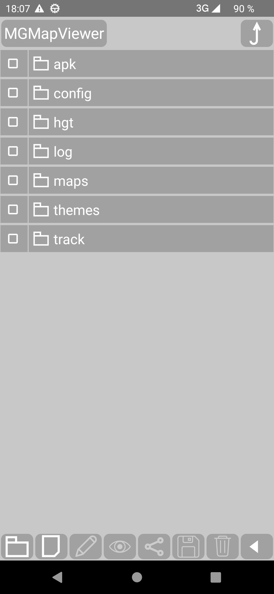

<small><small>[Back to Index](../index.md)</small></small>

## MGMapViewer 0.9.8 Version Info

Here you can find some information on the new verion 0.9.8. The main changes are:

- Support for Android 14
- Two line menu
- Internal File Manager

### Two line menu

Whenever you tap on one of the menu buttens (e.g. menu task ), the corresponding 
submenu will be shown in the line above.

   &nbsp;

With the display setting "Menu in one line" (default false) you switch this beahviour and get menu items in the same line (as in the past):

   &nbsp;

Additionally there is an animation to inflate/deflate the menu. This should help to make the submenu understandable. But if you don't like it,
you can set the "Menu animation timeout" very short, or even 0. Together with the one line option, this provides almost exactly the old menu behaviour. 

More inforamation about the menus and menu items you can found in the [feature description](../Features/FurtherFeatures/QuickControl/qcs_mgmapactivity.md)

### Internal File Manager

Starting with Android 10 google restricts the access to the main app directory more and more.
Now, with Android 14, its again more problematic.
The answer is: Use the new internal <b>File Manager</b>.

To open the file manager use  +  and you'll get the app 
main directory.

&nbsp;

It offers to browse, rename, share, receive via share, delete files.
For details checkout the [feature description](../Features/FurtherFeatures/FileManager/filemanager.md)

<small><small>[Back to Index](../index.md)</small></small>
